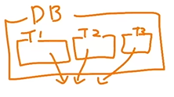

링크 : https://www.inflearn.com/course/lecture?courseSlug=%EC%B4%88%EB%B3%B4%EC%9E%90%EB%A5%BC-%EC%9C%84%ED%95%9C-%EB%B9%85%EC%BF%BC%EB%A6%AC-sql-%EC%9E%85%EB%AC%B8&unitId=209827&tab=curriculum

# 1-1. Big Query 기초지식

##  데이터 저장 형태
데이터는 보통 데이터베이스 테이블에 저장됨.

* Database - 데이터의 저장소

* Table - 데이터가 저장된 공간

----
## 데이터베이스의 특징-OLTP

**: 거래를 하기 위해 사용되는 데이터 베이스**

*거래 : ex) 음식주문

* 보류, 중간 상태가 없음 : 데이터가 무결하다
* 데이터의 추가(insert), 변경(update)는 많이 발생
* 처리속도 느림 >> OLAP의 등장
---

## SQL(Structured Query Language)
**: 데이터베이스에서 데이터를 가지고 올 때 사용하는 언어** 

## Big Query
**: 구글 클라우드의 OLAP + Data Warehouse = Big query** 

 ---
---

 # 1-2. Big Query의 환경 구성 요소

(1) 프로젝트
: 하나의 큰 건물 

(2) 데이터셋
: 프로젝트에 있는 창고

* 별도의 데이터를 저장할 수 있음.

(3) 테이블
: 창고에 있는 선반

* 상품의 세부정보가 저장.
* 행과 열로 일워진 데이터들이 저장됨

---
---

# 2-1. 데이터 활용 OVERVIEW

**데이터를 활용하는 과정**

1). **문제정의** 

    : 주어진 문제가 무엇이고, 어떤일을 해야하며, 원하는 결과는 어떤 것인지
    * 지표정의(metric)

    
2). **데이터 탐색** (V)
    
    * 단일 자료
    * 다량의 자료 -> 연결
    * 조건(필터링) / 추출 / 변환 / 요약(집계)

3). **데이터 결과 검증** (V)
   
    : 내가 예상한 것과 실제 결과가 동일한가?
    
    >> 매우매우중요!!!

4). **피드백 / 활용**

---

 # 2-2. 저장된 데이터 확인하기

 **<SQL 쿼리를 작성하기 전에>**
 
 ✅ 데이터의 저장 형태에 대해 생각해보기
   
   - 데이터 추출 전에 DW에 어떻게 저장되어있는지 확인해야함

   - ERD(Entitiy Relationship Diagram)을 확인해볼 것.
   
   : 데이터 베이스 구조를 한 눈에 알아보기 위해 사용(있을수도 없을수도~)

  

### Q. ERD가 없다면?
**A: 모든 데이터베이스를 직접 보면서 탐색**
- 어떤 테이블이 존재하는가?
- 어떤 컬럼이 존재하는가?(개수)
- 각 컬럼의 값들은 어떤 의미를 가지는가?
- 다른 테이블과 연결할 때 어떤 컬럼을 사용하는가?

    -> 보통 고유값인 id 컬럼을 많이 사용

