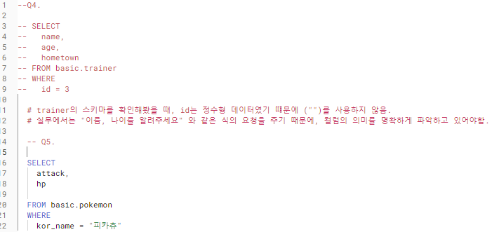
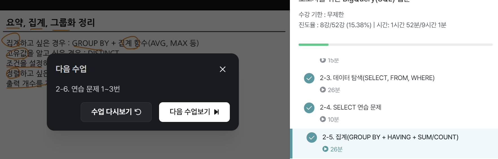

# 2-3. 데이터 탐색
## SQL 쿼리구조

- FROM
- WHERE
- SELECT
- 쿼리엔진 실행순서(FROM>WHERE>SELECT)


```
FROM 
    데이터셋.테이블 

-> 어떤 테이블에서 데이터를 확인할 것인지

Where 
    조건

SELECT
    Col 1 AS new name(별칭)

->테이블의 어떤컬럼을 출력할것인가
-> Col1을 별칭으로 가져오겠다.
```
>SELECT문 예시
```
SELECT 
* 
FROM basic.pokemon
WHERE 
    type = "Fire"

:basic이라는 dataset 중 pokemon이라는 table에서 type이 fire인 모든 컬럼(*)을 출력하겠다.

---
plus),

SELECT
* EXCEPT(제외할 컬럼이름)

** 별칭 설정할 때, 컬럼 이름에 (")를 사용하지 말 것.
```

----
---

# 2-4 연습문제


---
---

# 2-5 집계(GROUP BY + HAVING + SUM/COUNT)
: 그룹화해서 계산함
```
SELECT
    집계할 컬럼1,
    집계함수(COUNT,MAX,MIN...)
FROM 테이블명
GROUP BY
    집계할 컬럼1

***SELECT에 명시한 컬럼을 GROUP BY에도 명시해야함.
```

>**DISTINCT** 

: 고유값을 알고 싶은 경우
```
SELECT
    집계할 컬럼1,
    COUNT(DISTINCT 컬럼) #고유값을 알고 싶은 컬럼 
    EX)블로그를 방문한 유저의 수
FROM 테이블명
GROUP BY
    집계할 컬럼1

***SELECT에 명시한 컬럼을 GROUP BY에도 명시해야함.
```
---

**<Group by 할 때 고려할 점>**

1. **그룹화할 때 사용할 컬럼**:
    
     - 없을 수 있음. > (*)를 사용하거나 고유값을 다루는 id컬럼을 보통 사용
     (null값이 있을 때는 id컬럼을 사용하는 것을 권장)
     - '~별' 이면 ~에 해당하는 컬럶이 기준컬럼

2. **집계할 때 사용할 계산** 
    
    :수를 구한다 > count
    
---


---

> **WHERE & HAVING BY**

**WHERE**

: Table 에 바로 조건을 설정하는 경우

**HAVING BY**

: Group by 한 후 조건을 설정하는 경우

```
SELECT
    컬럼1, 컬럼2
    COUNT (컬럼 1) AS col1_count
FROM <table>
WHERE
    컬럼1 >= 3
GROUP BY 컬럼1, 컬럼2
HAVING
    col_count > 3 

-> where은 <table>에서, having은 count집계한 데이터에 대해서
```

> 서브쿼리

: SELECT문 안에 존재하는 SELECT쿼리
- From 절에 또 다른 select문을 넣을 수 있음
- 괄호로 묶어 사용
- group by & having 쓰는 것 권장

> 정렬하기(ORDER BY)
```
SELECT
    col
FROM
ORDER BY <컬럼><순서(DESC | OSC)>

*default는 오름차순
*쿼리의 마지막에 사용
```

> 출력개수 제한하기 (LIMIT)

: 쿼리문의 결과 ROW수를 제한하고 싶은 경우 사용
```
SELECT
    col
FROM
LIMIT 100
```


# GROUP BY 연습문제
Q. 포켓몬의 수를 ***타입별로 집계***하고, ***포켓문의 수가 10이상인 타입만*** 남기는 쿼리를 작성해라.(포켓몬의 수가 ***많은순***으로 정렬)


---
# 수강인증=^=
