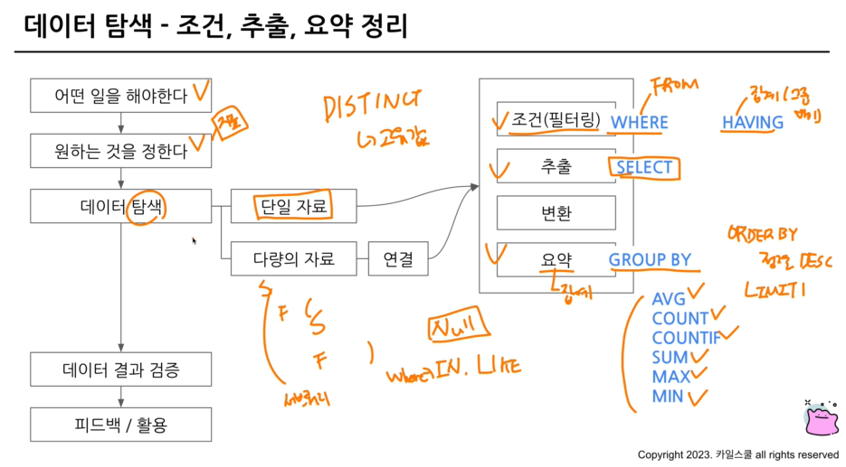
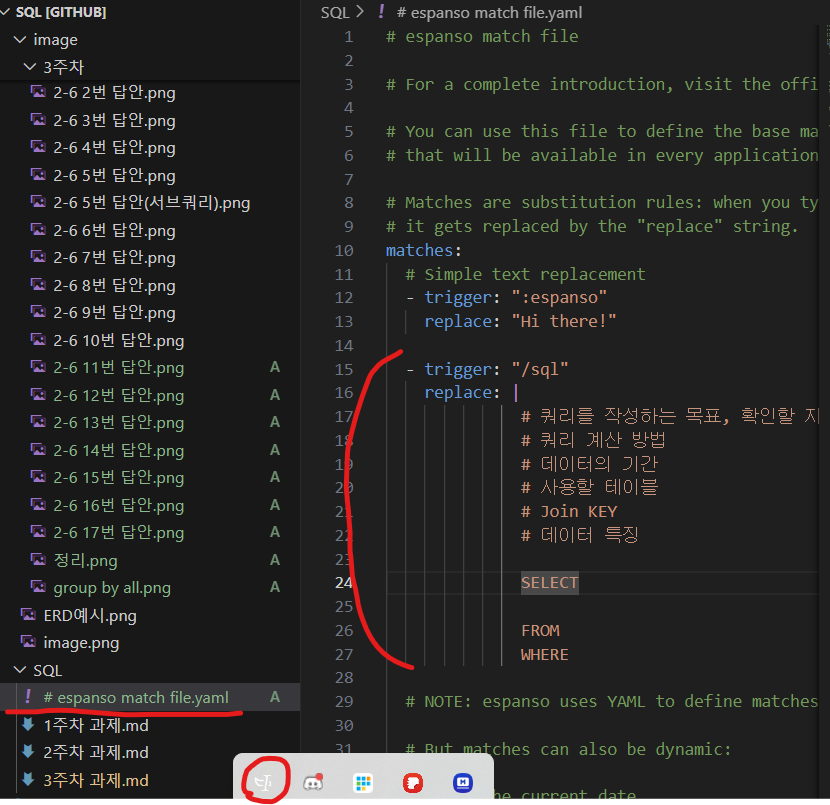
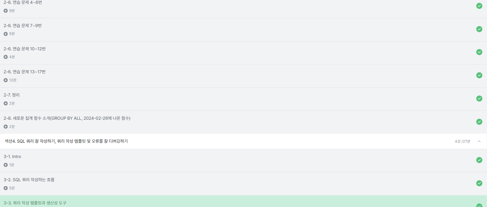

# 2-6. 연습문제

> SQL 코드를 작성할 때 고려할 것
- 조건
- 어떤 테이블? 어떤 컬럼?
- 어떻게 집계?

### Q1. 포켓몬 중에 type2가 없는 포켓몬의 수를 작성하는 쿼리를 작성하라.


```
~가 없다 : (컬럼) IS NULL
* NULL은 다른 값과 비교할 수 없음.

* AND 연산자로 여러 조건을 연결할 수 있음.
```
**✅어려웠던 점** 

count(id)할거여서 집계할 컬럼을 어떤 것을 사용할지 고민했는데 없어도 된다!!!!

---

### Q2. type2가 없는 포켓몬의 type1과 type1의 포켓몬 수를 알려주는 쿼리를 작성해라. 단, type1의 포켓몬 수가 큰 순으로 정렬할 것.


```
집계함수는 GROUP BY 와 같이 다님. 
집계하는 컬럼이 없으면 COUNT단독으로도 사용가능
```
**✅헷갈렸던 점** 

SELECT는 결과로 가져올 컬럼들을 명시하는 곳이다 !!!!!!!!!!!

문제를 읽고 어떤 결과를 보고 싶은건지를 확인하자

---

### Q3. type2 상관없이 type1의 포켓몬 수를 알 수 있는 쿼리를 작성하라.


```
✅DISTINCT를 사용하는 경우

고유한 값만(=중복없이) 보고 싶은 경우만 사용
  
해당 테이블에서의 id컬럼은 고유값으로 이루어진 컬럼이지만,어떤 컬럼은 중복이 있게 설계되었을수도 있음
-> DISTINCT도 걸어보고 어떤 방법이 적합한지 판단해보는것도 좋은 방법

예시)
* DAU (Daily Active User) : 하루에 접수한(활동한) 사용자의 수
: Active한 유저의 수를 하루 단위로 집계
```
---

### Q4. 전설 여부에 따른 포켓몬 수를 알 수 있는 쿼리를 작성


```
[TIP]
- GROUP BY 와 ORDER BY 에 컬럼이 많을 수 있는데, GROUP BY 3 혹은 ORDER BY 2 와 같은 식으로 표기하면 3번째 컬럼과 2번째 컬럼으로 인식이 가능하다.

단, 빠르게 결과를 '확인'할 경우에 권고하며 완성된 쿼리문에서는 가독성을 위해 컬럼을 명시하는게 좋다.

- 쿼리를 작성할 때 흐름에 따라 FROM -> WHERE -> SELECT 순으로 작성하는 것에 익숙해질것
```

### Q5. 동명이인이 있는 이름은 무엇일까요?


**서브쿼리를 사용한 쿼리**

.png>)

---

### Q6. trainer 테이블에서 "Iris" 트레이너의 정보를 알 수 있는 쿼리를 작성


```
❗주의할 점
   대·소문자 구분 확실히 할 것
```

---

### Q7. trainer 테이블에서 "Iris","Whitney","Cynthia"트레이너의 정보를 알 수 있는 쿼리를 작성


```
[TIP]
OR 조건으로 쓰기가 귀찮다 -> IN 사용
: name에 괄호 안의 값이 있는 row만 추출
```
---

### Q8.전체 포켓몬 수는 얼마나 될까?


```
unrecognized name 에러 : 컬럼이름에 오타일 가능성있음
```

---

### Q9. 세대(generation)별로 포켓몬 수가 얼마나 되는지 알 수 있는 쿼리를 작성


쉬운 문제였음

---

### Q10. tpye2가 존재하는 포켓몬의 수는 얼마나 될까?


```
특정컬럼의 값이 존재한다 -> NULL 값이 아니다
=> 컬럼 IS NOT NULL
```

**✅헷갈렸던 점** 

집계를 한다해서 GROUP BY가 반드시 있어야하는 것은 아니다. 

집계할 컬럼이 없으면 GROUPB BY를 쓰지 않는다. 

---

### Q11. type2가 있는 포켓몬 중에 제일 많은 type1은 무엇인가


```
" 제일 ~한 "
-> ORDER BY 설정후 LIMIT 1을 걸어서 가장 위에 값을 출력하도록 하면 됨
```

---

### Q12. 단일 타입( 하나의 타입만 있는) 포켓몬 중 제일많은 type1은 무엇인가


11번과 똑같은 맥락

---

### Q13. 포켓몬의 이름에 "파"가 들어가는 포켓몬은 어떤 포켓몬이 있을까?


```
특정문자가 들어가는 컬럼을 찾고 싶은 경우:
1) 컬럼 LIKE "%파" : "파"로 시작하는 단어

2) 컬럼 LIKE "파%" : "파"로 끝나는 단어
 
3) 컬럼 LIKE "%파%": "파"가 포함된 단어
```

---

### Q14. 뱃지가 6개 이상인 트레이너는 몇 명이 있을까?


이전의 문제들과 동일한 맥락

---

### Q15. 트레이너가 보유한 포켓몬(trainer_pokemon)이 제일 많은 트레이너는 누구인가? 


이전의 문제들과 동일한 맥락

---

### Q 16. 포켓몬을 많이 풀어준 트레이너는 누구인가?


이전의 문제들과 동일한 맥락

---

### Q 17. 트레이너 별로 풀어준 포켓몬의 비율이 20%가 넘는 포켓몬 트레이너는 누구인가?

* 풀어준 포켓몬의 비율 = (풀어준 포켓몬의 수 / 전체 포켓몬의 수)


```
COUNTIF(조건) : 특정조건을 만족하는 컬럼의 수를 세고 싶은 경우에 사용
```

---

# 2-7. 정리


# 2-8. 새로운 집계함수(GROUP BY ALL)


- Group by 할 컬럼을 직접 기입하지 않아도 자동으로 추론해 실행해주는 기능

---

# 섹션 4 - 쿼리 잘 작성하기
## 3-1 INTRO
<이번 파트에서 공부할 내용>
- SQL 쿼리를 작성하는 흐름
- 쿼리 작성 템플릿과 생산성 향상 도구
- 오류 디버깅 방법 

## 3-2 SQL 쿼리를 작성하는 흐름

1. **지표를 고민해라 + 문제정의**

   : 어떤 문제를 해결하기 위해서 데이터가 필요한가?

2. **지표 구체화**

   : 구체적인 지표 명시(정의시에 구체적인 이름의 분자, 분모 표시)
   - 문제의 요구조건 명시화
   - 어떤 결과를 도출해내야하는가

3. **지표 탐색**

   : 유사한 문제를 해결한 케이스가 있나 확인 (보통 비슷한 지표를 사용)
      - 있는 경우: 해당 케이스 참조
      - 없는 경우: 구글링(특정 도메인에서 활용하고 있는 지표)
      - 적당한 유사 케이스를 찾을 수 없을 때 -> 그제서야 쿼리 작성

4. **쿼리작성**

   : 데이터가 있는 테이블 찾기 : ERD

      - 데이터가 1개일 경우 : 활용
      - 데이터가 2개일 경우: Join

5. **데이터 정합성 확인**

   : 예상한 결과와 도출한 결과가 동일한지 확인

6. **쿼리 가독성**
7. **쿼리 저장**

   : 쿼리는 재사용됨 -> 문서화

✅ 실무에서는 1,5,6번이 가장 중요함.

## 3-3. 쿼리 작성 템플릿과 생산성 도구

작성해둔 템플릿을 습관화하지 못할 때 도와주는 것: 생산성 도구(쿼리작성외에도 활용할 수 있음)

**Espanso**

https://espanso.org/

   -특정 단어가 감지되면, 정의된것으로 바꾸는 기능 제공

  


### 수강인증
