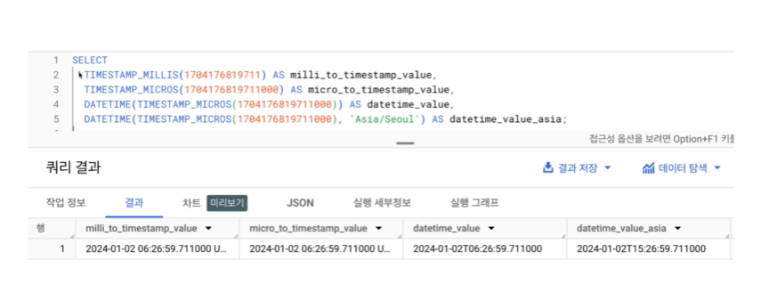
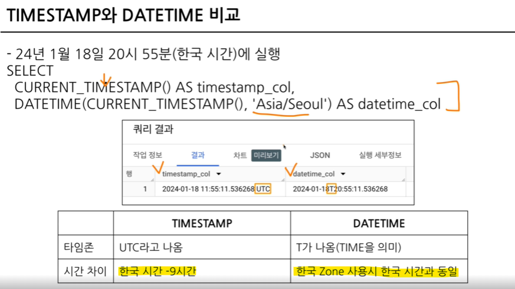
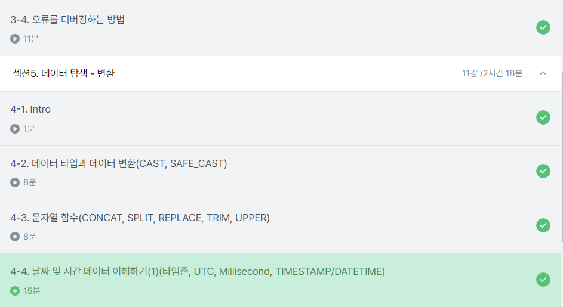

# 섹션 4.
## 3-4. 오류를 디버깅 하는 방법
**오류메시지 : 길잡이&문제진단 역할**

> ❌대표적인 오류 종류❌

<**Syntax Error : 문법 오류**>

해결방법 : error message를 보고 번역 혹은 해석한 후, 해결방법을 찾는다 (구글,ChatGPT,커뮤니티)

1. **Number of arguments does not match for aggregate function COUNT**

    : 집계함수 COUNT의 인자 수가 일치하지 않습니다.

    *COUNT는 1개의 인자만 가진다.

2. **SELECT list expression references column type1 a which is neither grouped nor aggregated**

    : SELECT 목록 식은 다음에서 그룹화되거나 집계되지 않은 열을 참조합니다.
    
    : GROUP BY에 적절한 컬럼을 명시하지 않았을 경우 발생하는 오류

3. **Expected ~ but got ~**

    : ~을 예상했지만 ~가 되었다.

    -> got ~ 뒤의 부분 근처를 확인해볼 것.

    -> 하나의 쿼리엔 SELECT가 1개만 있어야함

    -> 혹은 여러개의 쿼리가 있다면, 쿼리의 끝나는 부분마다 ;를 붙이고 실행할 부분만 드래그 & 드랍해서 실행할 것

# 섹션 5 : 데이터 탐색 - 변환
## 4-2. 데이터 타입과 데이터 변환(CAST, SAFE_CAST)

- SELECT문에서 데이터를 변환시킬 수 있음.

- WEHRE의 조건문에서도 가능
 
- 데이터 타입에 따라서 다양한 함수가 존재함

    -> 데이터 타입에 대한 학습이 필요!


> ⭐데이터 타입이 중요한 이유

**보이는 것과 저장된 것의 차이가 존재**

EX)

엑셀에서의 빈 값 - > "" OR NULL 일수도 있고

1 이라고 작성된 경우 -> 숫자 OR 문자 일수도

2023-12-31 -> DATE OR 문자 일수도

### 자료 타입을 변경하는 함수 : CAST_
```
SELECT
  CAST (1 AS STRING) #숫자 1을 문자 1로 변경
```

**_더 안전하게 데이터 타입 변경하는 함수 : SAFE_CAST_**

: SAFE_가 붙은 함수는 변환이 실패할 경우, NULL로 반환.(SAFE_가 없으면 그냥 오류남)

---

### 수학함수

암기하지 말고 필요할 때마다 찾아서 활용할 것.

** TIP **

나누기를 하는 경우,

X/Y 대신 SAFE_dIVIDE 함수 사용하기
```
SAFE_DIDVIDE(X,Y)
```
---

## 4-3. 문자열(STRING) 함수(CONCAT, SPLIT, REPLACE, TRIM, UPPER) 


> **CONCAT함수 : 문자열 붙이기**
```
SELECT
    CONCAT("안녕","하세요","!") AS result
```
- CONCAT의 인자로 문자열이나 숫자를 넣을 때는 데이터를 직접 넣은 것으로 **FROM이 없어도 실행 가능함**

---

> **SPLIT함수: 문자열 분리하기**


```
SELECT
    SPLIT("가,나,다,라",",") AS result
```


 - SPLIT(문자열 원본, 나눌 기준이 되는 문자)
 - 결과가 배열(array) 형태로 출력된다

 --- 

> **REPLACE 함수 : 특정 단어 수정(치환)하기**

```
SELECT
    REPLACE("안녕하세요","안녕","실천") AS result
```
- REPLACE (문자열 원본, 찾을 단어, 바꿀 단어)
---
 > **TRIM 함수 : 문자열 자르기**
 ```
 SELECT
    TRIM("안녕하세요","하세요")
 ```
 - TRIM(문자열 원본, 자를 단어)

 ---

> UPPER 함수 : 대문자로 변경
```
SELECT
    UPPER("abc") AS result
```

## 4-4.날짜 및 시간 데이터 이해하기(1)(타임존,UTC,Millisecond,TIMESTAMP/DATETIME)


### 시간 데이터 다루기- DATE, DATETIME, TIMESTAMP

* DATE : DATE만 표시 EX) 2023-12-31
* DATETIME : DATE + TIME EX) 2023-12-31 14:00:00 / TIME ZONE정보 없음
* TIME : 날짜없이 시간만 EX) 14:00:00

**타임존**

GMT:Greenwich Mean Time

영국의 그리니치 천문대(경도 0도) 를 기준으로 지역에 따른 시간의 차이를 조정하기 위해 생긴 시간의 구분선

-> 영국 근처에서 자주 활용

---

**UTC : Universal Time Coordinated**

: 국제적인 표준 시간
- 타임존이 존재한다 = 특정 지역의 표준 시간대가 있다.

- TIMESTAMP : UTC부터 경과한 시간을 나타내는 값.
- TIMEZONE정보 있음
EX) 2023-12-31 14:00:00 UTC

### 시간 데이터 다루기- millisecond,microsecond

- millisecond(ms) : 시간의 단위, 천분의 1초(1,000ms = 1초)

    -> 빠른 반응이 필요한 분야에서 사용 (초보다 더 정확)
    - millisecond > timestamp > datetime으로 변경
- microsecond : 1/1,000ms

**TIMESTAMP / DATETIME으로 변환하기**


❗변환시 **타임존('Asia/Seoul')이 존재**하는지 반드시 확인할 것❗

**TIMESTAMP와 DATETIME비교**


❗UTC 0시 = 한국의 오전 9시

❗DATETIME 실행시 한국의 시간과 다를 경우, TIMEZONE을 빼먹었을 수도 있음!

---

### 수강인증
