# 섹션 5. 데이터 탐색 - 변환

## 4-4. 날짜 및 시간 데이터 이해하기
### DATETIME - CURRENT_DATE / CURRENT_DATATIME

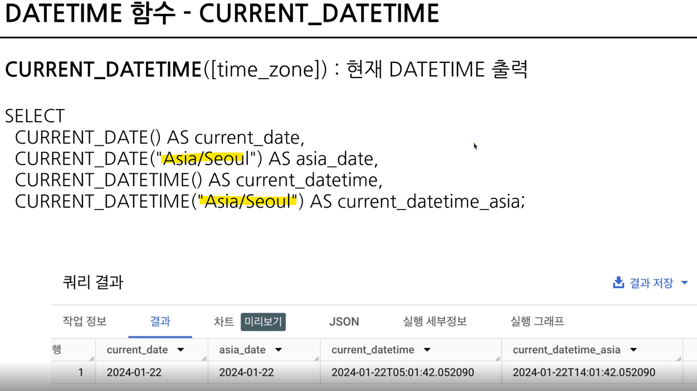

- 타임존을 입력하지 않으면 ASIA/SEOUL의 시간대와 -9 차이가 나는 시간결과가 나옴 

    => current_date와 asia_date간의 차이가 발생할 수도 있음.
    (일하는 시간대에는 거의 차이가 발생하지 않기때문에, 타임존을 입력했는지 확인 필수)
    
---

### EXTRACT함수

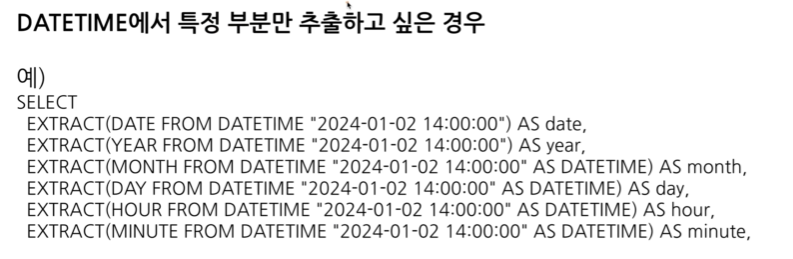


**EX) 일자별 매출, 월별 주문량 확인할 때 활용**

- part부분에는 우리가 알고 있는 대부분의 시간표현들(년,월,일,분기,주기,시간,분,초)등을 넣을 수 있음.

🫧 **week**

week은 일년에 53주정도, 그 범위중에 몇주차인지? / sunday로 시작하지만 변경가능 // 

더 자세한 것은 공식사이트 참고


❗**요일을 추출하고 싶은 경우**
```
EXTRACT(DAYOFWEEK FROM datatime_col)
```
: 한 주의 첫날이 **일요일**인 [1,7]범위의 값을 반환

- 월~금만 보고 싶으면 [2:6]

- 주말 : [1,7]


❗**DATE와 HOUR만 남기고 싶은 경우**


```
DATETIME_TRUNC(datetime_col, 남길 기준 (HOUR,DAY,YEAR,MONTH,HOUR....))
EX) 2024-11-01 02:43:13 ---> 2024-11-01 02:00:00
```

* 일자별, 시간대별 수요를 보고싶을 때 활용

* 년도나 월별로 잘라서 그 이후의 값(월,일)이 0이 될 수 없는 경우는 가장 작은 정수인 1을 표시함

---

### PARSE_DATETIME
**:문자열로 저장된 DATETIME을 *DATETIME 타입*으로 바꾸고 싶은경우**

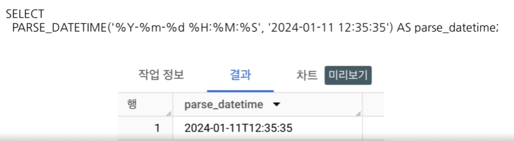

```
PARSE_DATETIME('문자열의 형태','DATETIME 문자열') AS 별칭
```
* 문자열의 형태(%Y/%M)가 어떤것을 뜻하는지 궁금하면 공식문서를 확인하면서 필요할 때 보고 적용
---

### FORMAT_DATETIME
**:DATETIME 타입 데이터를 특정 형태의 *문자열 데이터*로 변환하고 싶은 경우**
```
SELECT
    FORMAT_DATETIME("%c",DATETIME "2024-11-01 02:57:00) AS 별칭
```
---

### LAST DAY
**: 마지막 날을 알고 싶은 경우 자동으로 월의 마지막 값을 계산해서 특정연산을 할 경우에 활용**

```
SELECT
    LAST_dAY(DATETIME,기준)
```
* 기준에 WEEK 인자를 사용하는 경우

    -> WEEK기준으로 마지막 날짜를 알고 싶어.
        
    - 일요일을 기준으로 마지막 날짜를 알려주기 때문에 해당 주의 토요일의 날짜를 알려줌
    - WEEK(MONDAY)같은 표현으로 일요일을 마지막 날짜로 추출할 수 있으나 일요일 기준으로 많이 활용
    - BUT MONTH기준으로의 활용이 가장 보편적

---

### DATETIME_DIFF

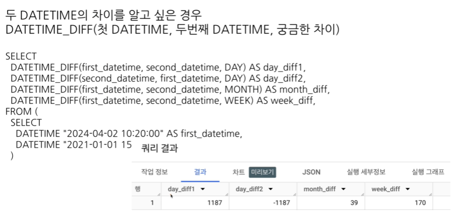

---

### 날짜 및 시간 데이터 정리
**날짜 및 시간 데이터**

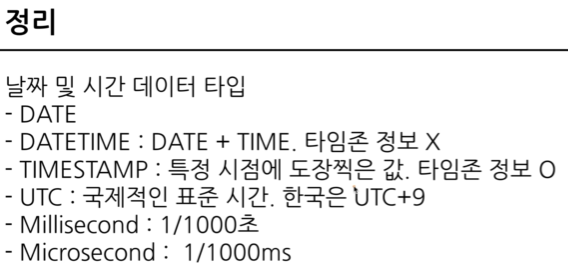

**시간 데이터의 변환**


**시간데이터의 활용**

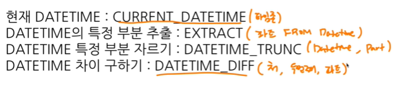

**Extract VS Trunc**

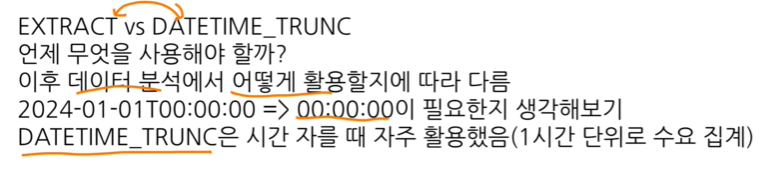

----

# 시간 데이터 연습문제 1~2번

## 연습문제 1번
```
Q1. 1. 트레이너가 포켓몬을 포획한 날짜(catch_date)를 기준으로, 2023년 1월에 포획한 포켓몬의 수를 계산해주세요.
```

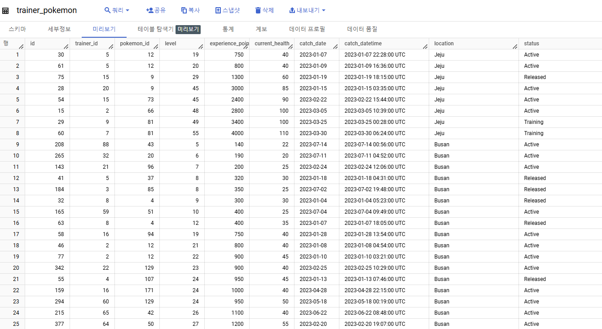

- 이상한 부분 : DATETIME컬럼

❗Datetime형식의 데이터는 UTC가 이미 반영된 데이터로 UTC가 적히지 않고, 오히려 T가 중간데 들어간다

❗UTC가 적혀있는 데이터는 TIMESTAMP타입 

❗컬럼의 이름만 믿고 쿼리를 작성할 것이 아니라 꼭 데이터의 형식을 확인해야함

❗catch_datetime이 변하면 catch_date에도 영향을줌. 

❓catch date => KR기준? UTC기준?인지 알아내는 방법

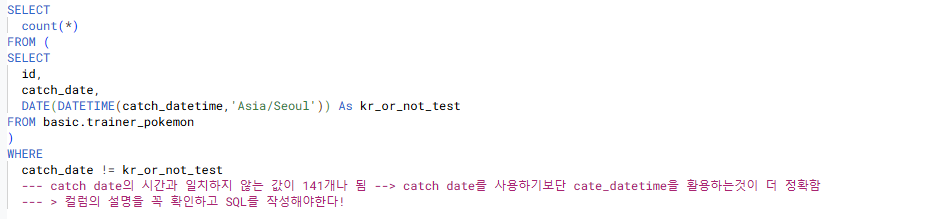

### 문제 1번 풀이

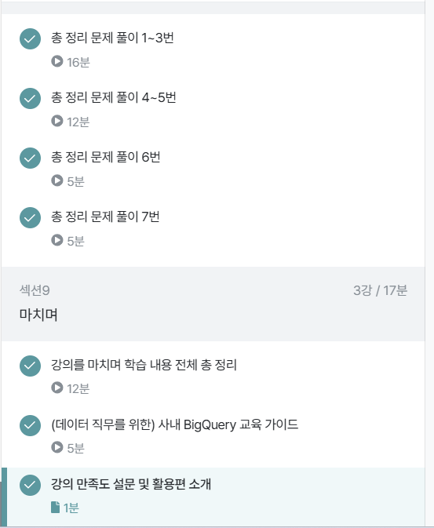

❗ 컬럼명에 속지 말자

❗DATETIME으로 변경시에 ***타임존*** 입력할것

## 문제 2번 
```
Q2. 배틀이 일어난 시간(battle_datetime)을 기준으로, 오전 6시에서 오후 6시 사이에 일어난 배틀의 수를 계산해주세요
```

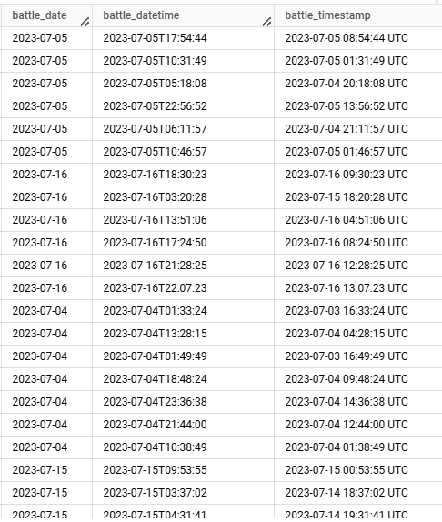

❗battle_datetime이랑 DATETIME(battle_timestamp,'ASIA/SEOUL')이랑 같은지 확인해볼 필요가 있음!

만일 동일하다면, 더 간단한 형식의 battle_datetime을 활용

### battle_datetime, battle_timestamp 검증


```
❗ Select에 집계함수 쓰면 집계함수가 아닌 것들과 같이 작성했을 때 오류가 난다.
주석처리를 하거나 다른 데이터를 활용할 것
```
- 검증결과 battle_datetime과 DATETIME(battle_timestamp)와 결과가 같았기 때문에 battle_datetime활용

### 문제 2번 풀이 과정


 `EXTRACT(HOUR FROM battle_datetime) >= 6
  AND EXTRACT(HOUR FROM battle_datetime) <= 18`

같이 사이값을 나타내기 위해 동일함수를 2번 활용하는 경우

`BETWEEN 6 and 18` 로도 나타낼 수 있다.

## 문제 2-1. 시간대별 battle의 개수 알아내기

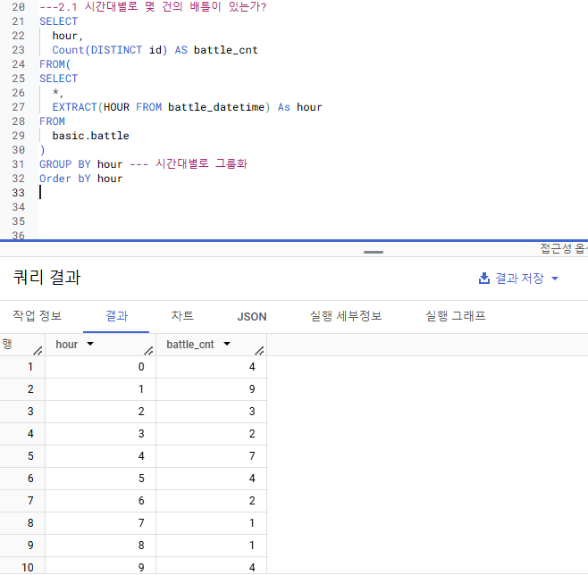

----

# 4-6 조건문(CASE, WHEN, IF)

**조건문 사용하는 방법**
1) CASE WHEN
2) IF

- SELECT문 안에서 컬럼의 값을 변환하고 싶을 때 활용
- 조건에 따라 다른값을 표시하고 싶을 때 사용

**조건문 함수가 활용되는 예시** 
* 1,2,3,4,5,6,7 => 월,화,수,목,금,토,일 로 변환하고 싶은 경우
* 월화수목금 => 주중 / 토일 => 주말
- 1~3학년 => 저학년 / 4~6 => 고학년
등의 전처리 과정에서 많이 활용

## CASE WHEN
```
SELECT
    CASE   
        WHEN 조건 1 THEN 조건 1이 참일 경우의 결과
        WHEN 조건 2 THEN 조건 2이 참일 경우의 결과
        ELSE 그 외 조건일 경우 결과
    END AS 별칭
FROM
```

### CASE WHEN 활용 예시


**❗ CASE WHEN은 순서가 중요하다**


- 조건1과 조건2에 둘다 해당한다는 가정하게, ROW 순서대로 첫번째 조건에서 처리가 되면 바로 다음 ROW로 넘어간다

- 숫자를 조건으로 둔다면 작은 수부터 조건으로 거는것이 하나의 방법일수도

- 특히 문자열 함수(특정 단어 추출)에서 이슈가 자주 발생

---

## IF

**단일 조건일 경우 유용**

```
IF(조건문, True일 때의 값, False일 때의 값) AS 별칭
```


### 4-7. 조건문 연습 문제
## 문제 1
```
포켓몬의 'speed'가 70이상이면 "빠름", 그렇지 않으면 "느림"으로 표시하는 새로운 컬럼 "speed_Category"를 만들어주세요
```


## 문제 2
```
포켓몬의 'type1'에 따라 'Water' , 'Fire', 'Electric' 타입은 각각 '물', '불', '전기'로, 그 외 타입은 '기타'로 분류하는 새로운 컬럼 'type_Korean'을 만들어라
```


## 문제3

```
각 포켓몬의 총점(total)을 기준으로, 300 이하면 "Low", 301에서 500사이면 "Medium", 501 이상이면 "High"로 분류
```


## 문제4

```
각 트레이너의 배지 개수(badge_count)를 기준으로, 5개 이하면 'Beginner', 6개에서 8개 사이면 'Intermediae', 그 이상이면 'Advanced'로 분류해라
```


**trainer_level 별 트레이너 수 보기(서브쿼리사용)** 


❗서브 쿼리 사용시, 세부쿼리에서 사용하지 않은 필드를 사용할 경우 에러발생함.

## 문제5

```
트레이너가 포켓몬을 포획한 날짜(catch_date)가 2023-01-01 이후이면, 'Recent', 그렇지 않으면 'Old'로 분류해라
```


**recent_or_old 별 트레이너 수 보기(서브쿼리사용)**


## 문제6

```
배틀에서 승자 (winner_id)가 player1_id와 같으면 'Player 1 Wins', plater2_id와 같으면 'Player 2 Wins', 그렇지 않으면 'Draw'로 결과가 나오게 해라
```


---

### 4-8. 정리


**숫자와 관련된 함수**

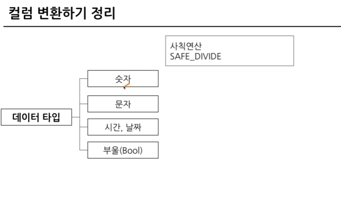

🫧 SAFE_DIVIDE : 연산이 안될 때 그냥 NULL 반환

**문자열과 관련된 함수**


**시간/날짜와 관련된 함수**

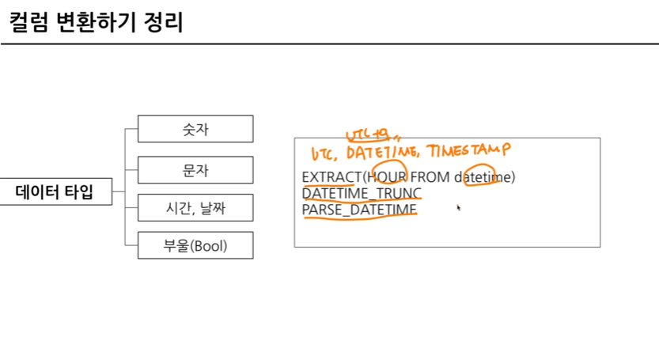


**데이터 타입관련 / 부울과 관련된 함수**

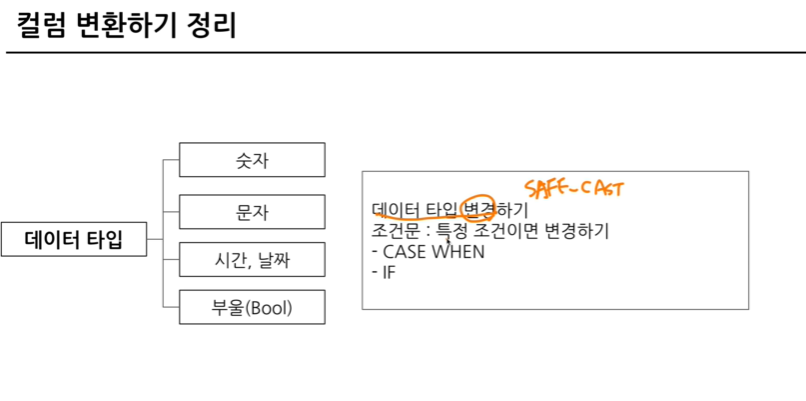

✅ 자주 쓰는 함수만 정확히 알아두고 필요할 때마다 공식문서 확인하기

# 4-9. BigQuery 공식 문서 확인하는 방법

**🔍 찾는 방법**

1) 기술명을 아는 경우

    구글에 **BigQuery 기술명 + documentation** 검색

2) 기술명을 모르나, 특정 작업을 하고 싶은 경우

    ex) I want to change string to int **in bigquery**

🫧stack overflow : 개발계의 지식인
🫧공식문서 Slack RSS Feed추가하기
- BigQuery Release Note페이지에서 확인
```
/feed subscribe + 구독할 페이지 url
```