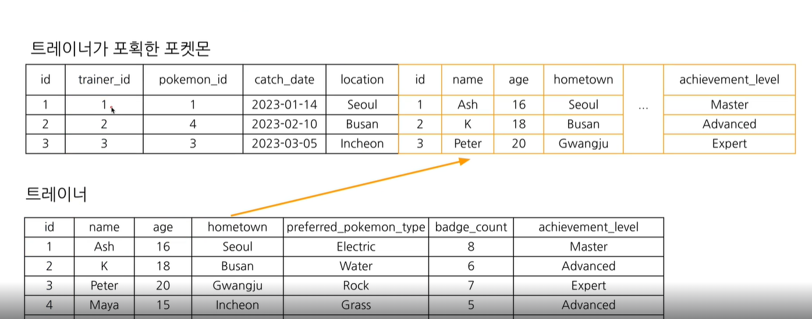
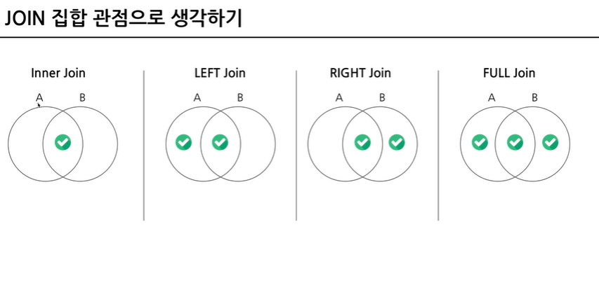
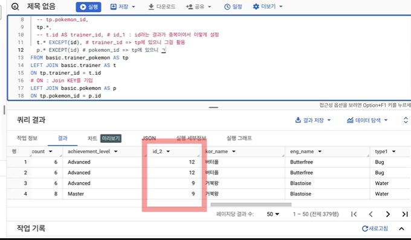
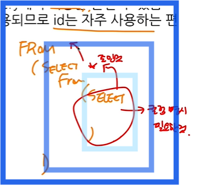
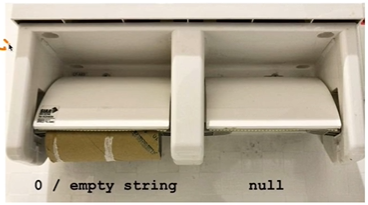

# Join 이해하기



2개의 테이블의 공통된 key를 기준으로 우측에 데이터를 추가하는 것.

- 여러 테이블간의 join도 가능하다

```
❗JOIN을 잘하는 방법

1. 저장된 형태를 먼저 확인한다.
2. join 후의 모습을 예상
3. 쿼리 실행&결과확인

1>2>3 반복
```
**JOIN을 해야하는 이유**

관계형 데이터베이스(RDBMS) 설계시, 정규화과정을 거치기 때문에 테이블이 여러개로 나눠져있는 경우가 있음.

*정규화 : 중복을 최소화하게 데이터를 구조화


최근 : 데이터 웨어하우스에서 JOIN + 필요한 연산을 해서 "데이터 마트"를 만들어서 활용

# 5-3. 다양한 JOIN방법

**다양한 SQL JOIN방법**


 


- (inner) joing : 두 테이블의 공통 요소만 연결
- left/right(outer) joing: 왼쪽/오른쪽 테이블 기준으로 연결
- full(outer) join : 양쪽 기준으로 연결
- cross join : 두 테이블의 각각의 요소를 곱하기


# 5-4. JOIN쿼리 공부하기

**❗TIP** 

LEFT가 될 테이블 : row수가 적으면서 내가 원하는 것을 다 포함하는 테이블, 즉 많이 참고할 기준 테이블


* ON : JOIN키를 입력하겠다는 의미.
```
ON A.key = B.key

: A의 key와 B의 key가 같은 값만 가져오겠다라는 의미
```

## SQL JOIN별  문법


**except()사용하는 이유**



- 각 테이블에서 중복되는 컬럼이 있어서 , 굳이 보고싶지 않은 경우 사용 (빨간 부분)

# 5-5. JOIN을 처음 공부할 때 헷갈렸던 부분

### Q. 여러 JOIN 중 어떤 것을 사용해야 하나요?

**하려고 하는 작업의 목적에 따라 선택해보세요**

- 교집합 : INNER
- 모두 다 조합 : CROSS
- 그게 아니라면 LEFT / RIGHT (LEFT 추천)
- 쿼리 작성 템플릿에 예상하는 결과를 작성하고, 중간 결과도 생각하면서 찾아보기

---

### Q. 어떤 TABLE을 왼쪽 / 오른쪽에 두나요?

**기준이 되는 TABLE을 왼쪽에 두세요**

- 기준값 : 내가 보고자 하는 데이터의 요소가 빠짐없이 다 있는 테이블인지.

---

### 여러 TABLE을 연결할 수 있나요?

**JOIN의 개수에 한계는 없으나, 너무 많이 JOIN하면 오류가 날 확률이 있음**

- 해결방법 : 중간 테이블을 만들어라


---

### 컬럼은 모두 다 선택해야 할까?

**어떤 데이터를 추출할지, 무엇을 해야하는가에 대한 고민을 해봐야 함**



- 하부 쿼리에서 EXCEPT와 같은 비슷한 처리를 했다면, 그 컬럼들이 상위쿼리에서는 (*)가 됨.

---

### NULL이 무엇인가요?



**값이 없음, 알 수 없음**

- 0 이나 공백과는 완전 다른, "값이 없음"을 나타냄
- JOIN에서는 연결할 값이 없는 경우 나타남


