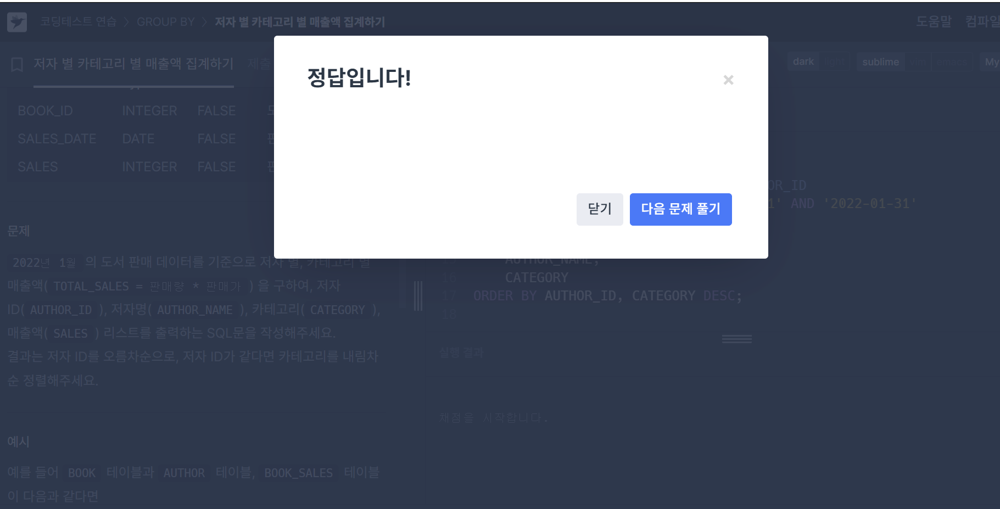

# 문제풀이(JOIN)
## #1. 저자별 카테고리별 매출액 집계하기
### 요구사항
2022년 1월의 도서 판매 데이터를 기준으로 저자 별, 카테고리 별 매출액(TOTAL_SALES = 판매량 * 판매가) 을 구하여, 저자 ID(AUTHOR_ID), 저자명(AUTHOR_NAME), 카테고리(CATEGORY), 매출액(SALES) 리스트를 출력하는 SQL문을 작성해주세요.
결과는 저자 ID를 오름차순으로, 저자 ID가 같다면 카테고리를 내림차순 정렬해주세요

### 작성한 쿼리

```MYSQL
SELECT 
    B.AUTHOR_ID,
    AUTHOR_NAME,
    CATEGORY,
    SUM(S.SALES*B.PRICE) TOTAL_SALES
FROM BOOK_SALES S 
JOIN BOOK B ON S.BOOK_ID = B.BOOK_ID
JOIN AUTHOR A ON B.AUTHOR_ID=A.AUTHOR_ID
WHERE SALES_DATE BETWEEN '2022-01-01' AND '2022-01-31'
GROUP BY 
    AUTHOR_ID,
    AUTHOR_NAME,
    CATEGORY
ORDER BY
    AUTHOR_ID, CATEGORY DESC;
```



### 🌱배운 점 + 헷갈렸던 것
- 문제를 풀면서 여러개의 JOIN을 활용하는 법을 숙지했다.
JOIN은 순서대로 일어나기 때문에, 서로 JOIN이 될 수 있는 컬럼이 있는 순서대로 JOIN을 했다.
- 쿼리가 길어지기 때문에 어려운 문제일수록 쿼리를 작성하는 순서에 대해서 체화? 나름의 규칙을 만드는 것이 필요하다는 생각이 들었다
> 1. 조건 필터링

> 2. 출력해야하는 컬럼들을 생각하며 JOIN 관계 생성

> 3. 집계 계산

> 4. GROUP BY

> 5. 정렬조건