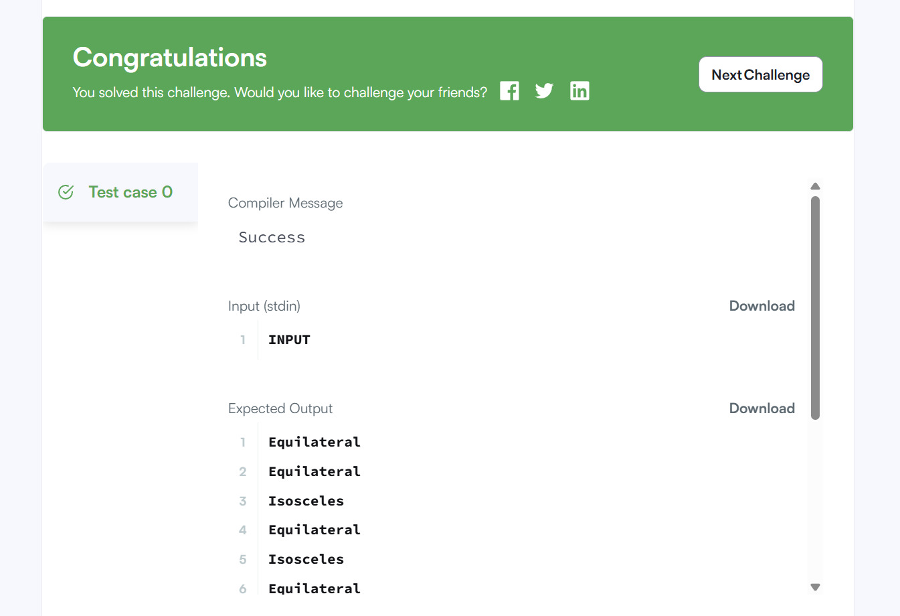

# 삼각형 종류 구별하기
## 요구사항
TRIANGLES 테이블에는 세변의 길이에 대한 정보가 담겨있는 A,B,C컬럼이 있다. 이 컬럼들을 통해서 해당 정보를 가진 삼각형이 어떤 삼각형인지를 구별해라.


## 작성한 쿼리
```MYSQL
SELECT CASE
    WHEN GREATEST(A,B,C) <= (A+B+C) - GREATEST(A,B,C) THEN 'Not A Triangle'
    WHEN A=B AND B=C THEN 'Equilateral'
    WHEN A=B OR A=C OR B=C THEN 'Isosceles'
    ELSE 'Scalene'
END AS TRIANGLE_TYPE
FROM TRIANGLES;
```



## 🌱배운점

**처음에 작성했던 쿼리문**
```MYSQL
SELECT CASE 
    WHEN A = B AND B = C THEN 'Equilateral'
    WHEN A = B OR B = C OR A = C THEN 'Isosceles'
    WHEN GREATEST(A, B, C) > (A + B + C) - GREATEST(A, B, C) THEN 'Not A Triangle'
    ELSE 'Scalene'
END AS TRIANGLE_TYPE
FROM TRIANGLES;
```

### 🔎 왜 오답이었을까?

#### 하나의 삼각형이 여러 조건을 동시에 만족할 수 있는 경우를 간과했기 때문!!!

**예시**

A=0, B=0, C=0인 경우: 삼각형 아님

➡️ 삼각형인지 아닌지를 먼저 판별 한 후에, 삼각형인 것들 사이에서 조건에 따라 삼각형을 분류하는 흐름의 쿼리가 필요했던 것. 


💡 조건에 따라 쿼리를 작성하는 것도 중요하지만, 논리적인 흐름 또한 쿼리를 작성하는 데에 있어 정말 중요한 요소임을 배웠다.


# 문제2

## 요구사항
## 작성한 쿼리
## 🌱배운점