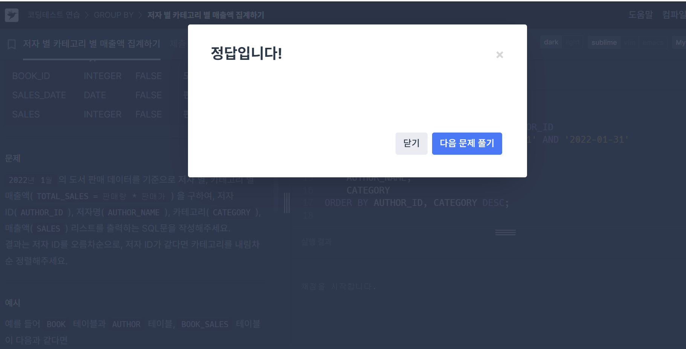

# 문제풀이(JOIN)
## #1. 저자별 카테고리별 매출액 집계하기
### 요구사항
2022년 1월의 도서 판매 데이터를 기준으로 저자 별, 카테고리 별 매출액(TOTAL_SALES = 판매량 * 판매가) 을 구하여, 저자 ID(AUTHOR_ID), 저자명(AUTHOR_NAME), 카테고리(CATEGORY), 매출액(SALES) 리스트를 출력하는 SQL문을 작성해주세요.
결과는 저자 ID를 오름차순으로, 저자 ID가 같다면 카테고리를 내림차순 정렬해주세요

### 작성한 쿼리

```MYSQL
SELECT 
    B.AUTHOR_ID,
    AUTHOR_NAME,
    CATEGORY,
    SUM(S.SALES*B.PRICE) TOTAL_SALES
FROM BOOK_SALES S 
JOIN BOOK B ON S.BOOK_ID = B.BOOK_ID
JOIN AUTHOR A ON B.AUTHOR_ID=A.AUTHOR_ID
WHERE SALES_DATE BETWEEN '2022-01-01' AND '2022-01-31'
GROUP BY 
    AUTHOR_ID,
    AUTHOR_NAME,
    CATEGORY
ORDER BY
    AUTHOR_ID, CATEGORY DESC;
```



### 🌱배운 점 + 헷갈렸던 것
- 문제를 풀면서 여러개의 JOIN을 활용하는 법을 숙지했다.
JOIN은 순서대로 일어나기 때문에, 서로 JOIN이 될 수 있는 컬럼이 있는 순서대로 JOIN을 했다.
- 쿼리가 길어지기 때문에 어려운 문제일수록 쿼리를 작성하는 순서에 대해서 체화? 나름의 규칙을 만드는 것이 필요하다는 생각이 들었다
> 1. 조건 필터링

> 2. 출력해야하는 컬럼들을 생각하며 JOIN 관계 생성

> 3. 집계 계산

> 4. GROUP BY

> 5. 정렬조건

# 문제풀이(비트연산자)
## #2. 언어별 개발자 분류하기

### 요구사항

DEVELOPERS 테이블에서 GRADE별 개발자의 정보를 조회하려 합니다. GRADE는 다음과 같이 정해집니다.

A : Front End 스킬과 Python 스킬을 함께 가지고 있는 개발자
B : C# 스킬을 가진 개발자
C : 그 외의 Front End 개발자
GRADE가 존재하는 개발자의 GRADE, ID, EMAIL을 조회하는 SQL 문을 작성해 주세요.

결과는 GRADE와 ID를 기준으로 오름차순 정렬해 주세요.

### 내가 작성한 쿼리

```MYSQL
WITH GRADE_TABLE AS (
    SELECT 
    CASE WHEN SKILL_CODE & (SELECT SUM(CODE) FROM SKILLCODES WHERE CATEGORY = 'FRONT END') > 0  AND SKILL_CODE & (SELECT SUM(CODE) FROM SKILLCODES WHERE NAME = 'PYTHON') > 0 THEN 'A'
    WHEN SKILL_CODE & (SELECT SUM(CODE) FROM SKILLCODES WHERE NAME = 'C#') > 0 THEN 'B'
    WHEN SKILL_CODE & (SELECT SUM(CODE) FROM SKILLCODES WHERE CATEGORY = 'FRONT END') > 0 THEN 'C'
    END AS GRADE,
    ID,
    EMAIL
    FROM DEVELOPERS
    )

SELECT * 
FROM GRADE_TABLE
WHERE GRADE IS NOT NULL
ORDER BY GRADE, ID;
```

.png>)

### 🌱배운 점 + 헷갈렸던 것
- 10진수를 2진수로 바꾸는 방법
- 비트 연산자 사용법

**각 컬럼이해**

- `SKILL_CODE`: 보유하고 있는 스킬들의 CODE를 모두 더한 숫자
- `CODE`: 각 스킬에 대한 코드들이 2진수로 표현되어 있음


**`SKILL_CODE & CODE`**

:각각의 개발자가 어떤 스킬들을 갖고 있는지 파악하려면 비트연산자(&)를 아래와 같이 활용해서 어떤 비트가 켜지는지 확인


**SUM(CODE)를 한 이유**

💡 CATEGORY가 FRONT END인 스킬들이 여러개였기 때문에, 그것들이 SKILL_CODE값에 하나라도 포함되어있는지 확인하기 위해서는 CATEGORY = FRONT END인 값들을 모두 더한 후 비교하는 방법이 있음 

- 하나라도 포함하면 1 이상의 2의 제곱 수가 출력됨.

**JOIN과 서브쿼리를 모두 이용할 수 없을 때에는 WITH문을 통해 새로운 테이블을 만든 뒤에 JOIN을 하자**


