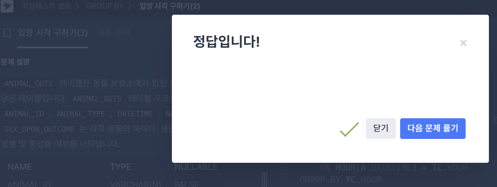

# 우유와 요거트가 담긴 장바구니 찾기
## 요구사항
우유와 요거트를 동시에 구입한 장바구니의 아이디를 조회하는 SQL 문을 작성하라. 이때 결과는 장바구니의 아이디 순으로 나와야 한다.

## 작성한 쿼리

```MYSQL
SELECT CART_ID
FROM CART_PRODUCTS
GROUP BY CART_ID
HAVING GROUP_CONCAT(NAME) LIKE '%Yogurt%' AND
    GROUP_CONTCAT(NAME) LIKE '%Milk%
ORDER BY CART_ID;
```


## 배운 점(오답노트)

**처음 작성한 코드**
```MYSQL
SELECT CART_ID
FROM CART_PRODUCTS
WHERE GROUP_CONCAT(NAME) IN 'Yogurt' AND
    GROUP_CONTCAT(NAME) IN 'Milk'
GROUP BY CART_ID
ORDER BY CART_ID;
```

📝 `GROUP_CONCAT()`은 집계함수

- 일반적으로는 `GROUP BY`와 함께 사용됨됨
- 그룹단위 함수 → GROUP BY 이후에 HAVING절에서 사용
    - WHERE절은 행단위 조건

📝 IN은 **리스트와 함께 사용**해서 리스트 안에 원하는 값이 있는지 확인 + 문자열 전체가 정확히 일치하는지를 파악할 때 사용 
  
```MYSQL 
A IN ('Milk','Yogurt')
```
- MILK만 있어도 TRUE
- Yogurt만 있어도 TRUE
- MILK, YOGURT → ❌

내가 원하는 것은 GROUP_CONCAT한 값 안에 MILK와 YOUGURT가 동시에  ❗포함❗되어있는지를 확인하는 것

➡️ LIKE사용

--------

# 언어별 개발자 분류하기

## 요구사항

 각 개발자가 보유한 기술 목록과 기술 카테고리를 요약하여 출력하는 쿼리를 작성하라.


## 작성한 쿼리
```MYSQL
SELECT
    ID,
    EMAIL
    GROUP_CONCAT(NAME) AS NAME
    GROUP_CONCAT(CATEGORY) AS CATEGORY
FROM DEVELOPERS D
JOIN SKILLCODES S
ON S.CODE & D.SKILL_CODE != 0
GROUP BY ID, EMAIL
ORDER BY ID;
```


## 배운점

### 📝비트연산자 정리(복습)

| 연산자 | 이름     | 예시 (a=5, b=3)               | 결과 비트값 |
|--------|----------|-------------------------------|--------------|
| &    | AND      | 5 & 3 = 101 & 011 = 001 | 1            |
| `|`    | OR       | 5 \| 3 = 101 \| 011 = 111 | 7            |
| ^    | XOR      | 5 ^ 3 = 101 ^ 011 = 110 | 6            |

------

# 입양이 가장 활발한 시간대 구하기

## 요구사항

보호소에서는 몇 시에 입양이 가장 활발하게 일어나는지 알아보려 한다. 0시부터 23시까지, 각 시간대별로 입양이 몇 건이나 발생했는지 조회하는 SQL문을 작성하라. 이때 결과는 시간대 순으로 정렬해야 한다.

## 작성한 쿼리

```MYSQL
WITH RECURSIVE TIME_COUNT AS(
    SELECT 0 AS HOUR
    UNION ALL
    SELECT HOUR + 1 FROM TIME_COUNT WHERE HOUR < 23
    )
SELECT 
    TC.HOUR AS HOUR,
    COALESCE(COUNT(A.ANIMAL_ID),0) AS COUNT
FROM TIME_COUNT AS TC
LEFT JOIN
    ANIMAL_OUTS A
    ON HOUR(A.DATETIME) = TC.HOUR
GROUP BY TC.HOUR
ORDER BY TC.HOUR;
```


## 🌱배운점

문제를 풀면서 WITH RECURSIVE문에 대해서 더 잘 이해할 수 있었다.

✔️ `SELECT 0 AS HOUR`  : 초기 값 0으로 설정

✔️ `SELECT HOUR + 1 FROM TIME_COUNT WHERE HOUR < 23`
- 1시간씩 늘릴 건데, 23시까지 출력할 것이기 때문에, TIME_COUNT의 HOUR(HOUR+1)가 23이전까지로 설정해야한다.

✔️ ANIMAL_OUTS 테이블과 조인할 때, TC의 HOUR 형태와 비슷하게 하기 위해서 HOUR(A.DATETIME)과 TC.HOUR가 동일한 것을 키로 설정

✔️ 일정 시간대에 입양된 경우가 없는 경우 NULL값처리가 되기 때문에, `COALESCE(COUNT(A.ANIMAL_ID),0)`를 활용해 NULL인 경우 0으로 처리하겠다고 설정


오랜만에 풀었더니 넘나 어려웠당..~
