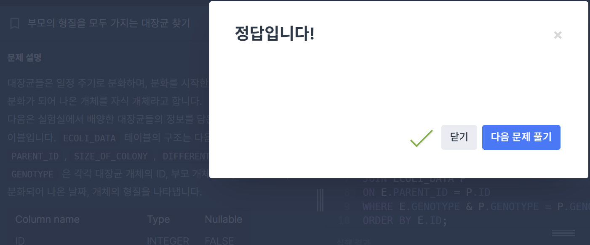

# 서울에 위치한 식당 목록 구하기

## 요구사항
REST_INFO와 REST_REVIEW 테이블에서 서울에 위치한 식당들의 식당 ID, 식당 이름, 음식 종류, 즐겨찾기수, 주소, 리뷰 평균 점수를 조회하는 SQL문을 작성해주세요. 이때 리뷰 평균점수는 소수점 세 번째 자리에서 반올림 해주시고 결과는 평균점수를 기준으로 내림차순 정렬해주시고, 평균점수가 같다면 즐겨찾기수를 기준으로 내림차순 정렬해주세요.

## 작성한 쿼리

```MYSQL
SELECT 
    RI.REST_ID,
    REST_NAME,
    FOOD_TYPE,
    FAVORITES,
    ADDRESS,
    ROUND(AVG(REVIEW_SCORE),2) AS SCORE
FROM REST_INFRO RI
JOIN REST_REVIEW RR
ON RI.REST_ID = RR.REST_ID
WHERE REGEXP_LIKE(ADDRESS,'^서울')
GROUP BY
    RI.REST_ID,
    REST_NAME,
    FOOD_TYPE,
    FAVORITES,
    ADDRESS
ORDER BY SCORE DESC, FAVORITES DESC;
```


## 느낀 점
✔️ AVG 집계를 하니까 GROUP BY 놓치지 말것!

✔️정규표현식 활용방법을 잘 활용하면 쿼리를 효율적으로 작성할 수 있을 것 같다!

---
# 부모의 형질을 모두 가지는 대장균 찾기

## 요구사항
부모의 형질을 모두 보유한 대장균의 ID(ID), 대장균의 형질(GENOTYPE), 부모 대장균의 형질(PARENT_GENOTYPE)을 출력하는 SQL 문을 작성해주세요. 이때 결과는 ID에 대해 오름차순 정렬해주세요.

## 작성한 쿼리

```MYSQL
SELECT
    I.ID,
    I.GENOTYPE,
    P.GENOTYPE AS PARENT_GENOTYPE 
FROM ECOLI_DATA E
JOIN ECOLI_DATA P 
ON I.PARENT_ID = P.ID
WHERE E.GENOTYPE & P.GENOTYPE = P.GENOTYPE
ORDER BY ID;
```



## 배운 점

### 🔎SELF JOIN 을 한 이유
`PARENT_ID`는 그저 부모 개체의 ID번호이기 때문에, 자식 형질과 부모의 형질을 비교하기 위해서는 부모개체의 GENOTYPE이 필요하다.

따라서 SELF JOIN의 조건을 `I.PARENT_ID = P.ID`으로 설정함으로써 부모의 GENOTYPE을 가져올 수 있도록 하는것이 이 문제의 핵심!!이었던 것 같다.

### 비트 연산자 활용
"자식의 형질이 부모의 형질을 모두 **포함**하고 있다" 는 것에서 `비트연산자 &`를 사용해야한다는 힌트를 얻을 수 있다.


끄읏~🌟