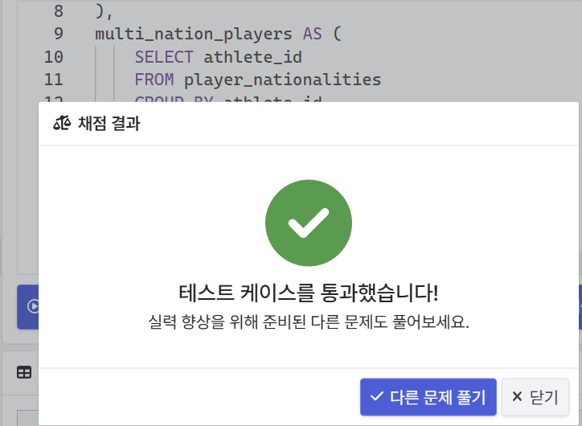
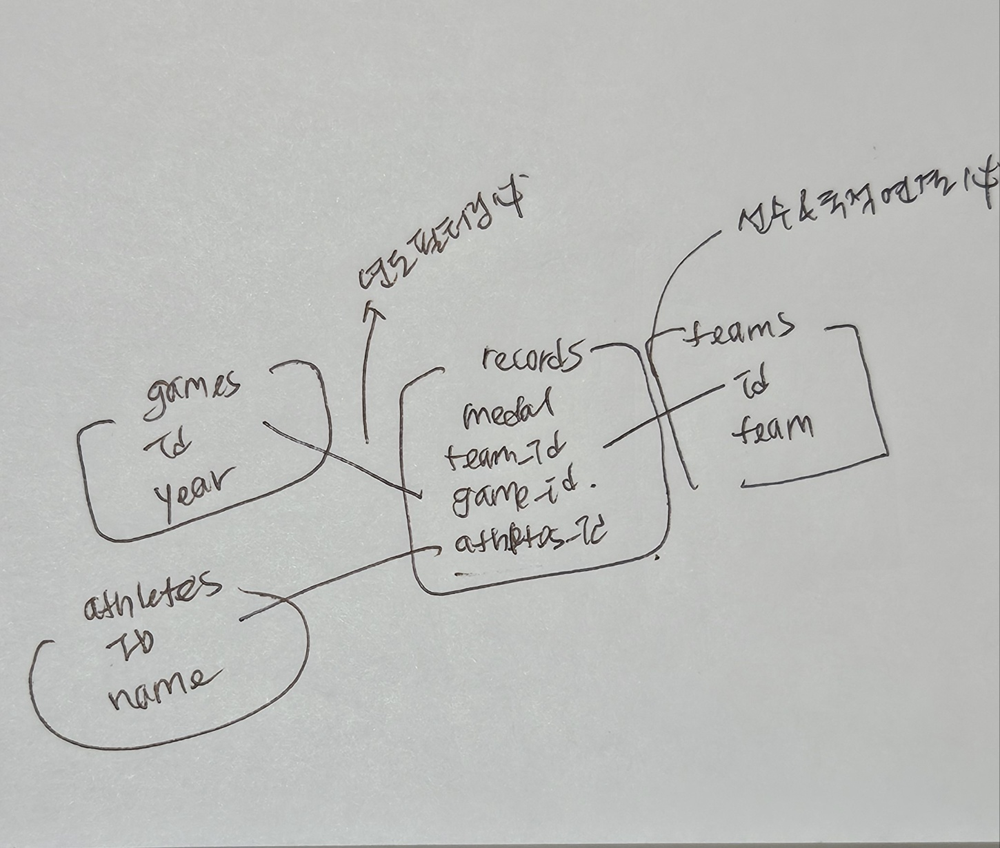

# 1. 복수 국적 메달 수상한 선수 찾기

## 요구사항
2000년 이후의 메달 수상 기록만 고려했을 때, 메달을 수상한 올림픽 참가 선수 중 2개 이상의 국적으로 메달을 수상한 기록이 있는 선수의 이름을 조회하는 쿼리를 작성해주세요. 조회된 선수의 이름은 오름차순으로 정렬되어 있어야 합니다.

## 작성한 쿼리
```MYSQL
WITH player_nationalities AS(
    SELECT athlets_id, t.team
    FROM records r
    JOIN teams t ON t.id = r.team_id
    JOIN games g ON g.id = r.game_id
    WHERE medal IS NOT NULL AND g.year >= 2000
),  ---1️⃣ 1차 필터링: 2000년도 이후의 게임에서 메달이있는 선수의 아이디와 국적에 대한 데이터(`athletes_id, t.team`) 컬럼만 있는 테이블 형성

WITH multinationalities_player AS(
    SELECT athlete_id
    FROM player_nationalities
    GROUP BY athlete_id
    HAVING COUNT(DISTINCT team) >= 2
) --- 2️⃣ 2차 필터링: 이전에 생성한 테이블을 활용해서 국적이 2개이상인 선수들 필터링

SELECT a.name
FROM multinationalities_player m
JOIN athletes a 
ON a.id = m.athletes_id
ORDER BY a.name;

3️⃣ 2차 필터링 한 테이블과 athletes테이블과 조인해서 이름 출력
```


### 📝문제 접근 흐름

1. 필터링 조건 정리
- 2000년도 이후 `year >= 2000`
- 메달 수상자만
` medal IS NOT NULL`

2. 선수가 2개이상의 국적이어야 함
⇒ 같은 선수가 다른 team 이름으로 메달을 획득한 경우가 있어야함.
 
💡선수별로 국가를 count했을 때 2개 이상이면 조건 충족

3. 활용할 컬럼들 정리

- 선수 이름: `athletes.name`
- 국적: `teams.team`
- 년도: `games.year`
- 메달 수상 여부: `records.medal`

[필요한 변수들의 연결 구조 정리]



## 배운 점

### 처음 작성한 쿼리
```
SELECT
 a.name
FROM records r 
JOIN games g ON g.id = r.game_id
JOIN teams t ON t.id = r.team_id
JOIN athletes a ON a.id = r.athlete_id
WHERE g.year >= 2000 and r.medal IS NOT NULL
GROUP BY a.name
HAVING COUNT(distinct t.team) >= 2
ORDER BY a.name;
```
✔️ 정답결과: 13개, 내가 작성한 쿼리로 나온 출력개수: 14개

### 🔎 왜 틀렸을까?

선수이름이 중복일수도 있나?! 

💡WITH문으로 아예 선수_국적 테이블과, 멀티 국적을 구분하는 테이블로 따로 빼서 중복의 가능성을 아예 제거해야겠다!

➡️`athletes.id` 활용해서 중복 제거

---

# 2. 온라인 쇼핑몰의 월별 매출액 집계

## 요구 사항
온라인 쇼핑몰의 월 별 매출 규모를 한 눈에 파악할 수 있는 데이터를 만들고 싶습니다. 위 두 테이블의 데이터를 조합해 월 별로 취소 주문을 제외한 주문 금액의 합계, 취소 주문의 금액 합계, 그리고 총 합계를 계산하는 쿼리를 작성해주세요. order_id가 C로 시작하는 주문이 취소 주문입니다. 결과 데이터는 아래 4개 컬럼을 포함해야 하고 order_month 컬럼의 값으로 오름차순 정렬되어 있어야 합니다.

## 작성한 쿼리

```MYSQL
SELECT
    SUBSTR(o.order_date,1,7) as order_month,
    SUM(CASE WHEN oi.order_id NOT LIKE 'C%' THEN oi.price * oi.quantity END) AS ordered_amount,
    SUM(CASE WHEN oi.order_id LIKE 'C%' THEN oi.price * oi.quantity END) AS canceled_amount,
    SUM(CASE WHEN oi.order_id NOT LIKE 'C%' THEN oi.price * oi.quantity ELSE oi.price * oi.quantity END) AS total_amount
FROM order_items oi
JOIN orders o
ON o.order_id = oi.order_id
GROUP BY order_month
ORDER BY order_month;
```

✔️SQL LITE는 DATE_FORMAT이랑 LEFT기능이 없어서 SUBSTR활용

✔️취소 주문 같은 경우에는 quantity자체가 음수였는데, 그것도 모르고 계속 -1곱해서 좀 헤맴...

    ➡️ 컬럼 설명을 꼭꼭 잘 숙지하자~~!!^^


### 📝문제 접근 흐름

1. 위 두테이블의 데이터를 조합해 
➡️ order_items.order_id = orders.order_id

2. '월별로'
➡️ GROUP BY(order_date)

3. 조건 확인하기
- order_month: YYYY-MM 형식으로 표기된 주문 연, 월 정보
- ordered_amount: <u>취소 주문을 제외한</u> 주문 금액의 합계 ➡️SUM()
- canceled_amount: 취소 주문의 금액 합계 (음수로 표시) ➡️SUM()
- total_amount: 취소 주문을 포함한 주문 금액의 총 합계 
    ➡️ orderd_amount + canceled_amount

---

# 3. 세명이 서로 친구인 관계 찾기

## 요구사항
주어진 데이터를 활용해 ID가 3820인 사용자를 포함해 세 명의 사용자가 친구 관계인 경우를 모두 출력하는 쿼리를 작성해주세요. 쿼리 결과에는 아래 컬럼이 포함되어 있어야 합니다.

- user_a_id: 친구 관계인 사용자 ID (A)
- user_b_id: 친구 관계인 사용자 ID (B)
- user_c_id: 친구 관계인 사용자 ID (C)

중복된 세 친구 관계를 제외하기 위해 `user_a_id < user_b_id < user_c_id`를 만족하는 경우만 출력되어야 합니다.

## 작성한 쿼리
```MYSQL
SELECT
    e1.user_a_id as user_a_id,
    e1.user_b_id as user_b_id,
    e2.user_b_id as user_c_id
FROM edges e1
JOIN edges e2 ON e1.user_a_id = e2.user_a_id AND e1.user_b_id < e2.user_b_id
JOIN edges e3 ON e3.user_a_id = e1.user_b_id AND e3.user_b_id = e2.user_b_id
WHERE 3820 IN (e1.user_a_id, e1.user_b_id,e2.user_b_id) -- SELECT에서 부여한 컬럼명이 반영되지 않음 주의!
        AND e1.user_a_id < e1.user_b_id
        AND e1.user_b_id < e2.user_b_id
ORDER BY user_a_id, user_b_id, user_c_id;
```


### 📝문제 접근 흐름
1. (A,B)(A,C)(B,C) 삼각형구조로 서로 친구여야 함


➡️ 셀프조인으로 E1,E2,E3생성해서 A-B, A-C, B-C 관계 확인후 A,B,C중에 3820이 존재하는지 확인

- E1: A-B
- E2: A-C
- E3: B-C OR C-B

참고해서 on 조건 부여하기

➡️ A < B < C 조건도 충족하도록


## 느낀점
SELF JOIN 할 때 중요한 것은 어떤 컬럼과 어떤 컬럼을 연결지을지 미리 고민해볼 것!!


