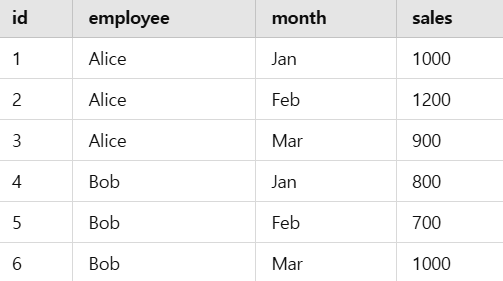

# Window 함수
## Window함수의 개념과 문법
    
### window함수의 개념
**행 집행**에 대해 집계와 유사한 연산을 수행함.

**❗집계연산과 윈도우 함수의 차이❗**
- 집계연산: 데이터를 요약해서 <U>단일 결과 행</U>으로 그룹화 `GROUP BY`
- 윈도우함수: 개별 행을 유지하면서 해당 행과 관련된 그룹 내에서 계산을 수행한다. `OVER(PARTITION BY)..`

    ➡️ 집계 결과를 개별 행과 함께 보고싶은 경우에 활용

## Over
> 윈도우 함수가 어떤 행을 기준으로 쿼리를 처리할지 정의하는 역할

**Over절의 2가지 형태**
```MYSQL
1. OVER(window spec)
2. OVER(미리 정의한 window_name)
```

- OVER(): 쿼리 내의 모든 행을 사용. 전체의 합 -> 각자 행의 합

- OVER(PARTITIONI BY 컬럼명): 개별행에 대해 컬럼명을 기준으로 SUM 집계 진행

- `SELECT`와 `ORDER BY`에서만 사용가능하다. 

- 아래 함수들에 대해서는 over절이 필수적이다.
    ```
    CUME_DIST()
    DENSE_RANK()
    FIRST_VALUE()
    LAG()
    LAST_VALUE()
    LEAD()
    NTH_VALUE()
    NTILE()
    PERCENT_RANK()
    RANK()
    ROW_NUMBER()
    ```


### **window_spec구성요소**
```MYSQL
[window_name] [PARTITION BY ...] [ORDER BY ...] [frame_clause
```
`PARTITION BY... `
- 행들을 부분 그룹으로 나눔
- PARTITION이 생략\되면, 전체가 하나가 됨***

`FRAME_CLAUSE`      
- 현재 행을 기준으로 어느 범위까지 계산에 포함할지 정함
EX)  `UNBOUNDED PRECEDING AND CURRNET`   

---

# 14.20.1 윈도우 함수 설명(비집계)

## 💡예시 쿼리
```MYSQL
 SELECT
    val,
    ROW_NUMBER()   OVER w AS 'row_number',
    CUME_DIST()    OVER w AS 'cume_dist',
    PERCENT_RANK() OVER w AS 'percent_rank'
FROM numbers
WINDOW w AS (ORDER BY val);
+------+------------+--------------------+--------------+
| val  | row_number | cume_dist          | percent_rank |
+------+------------+--------------------+--------------+
|    1 |          1 | 0.2222222222222222 |            0 |
|    1 |          2 | 0.2222222222222222 |            0 |
|    2 |          3 | 0.3333333333333333 |         0.25 |
|    3 |          4 | 0.6666666666666666 |        0.375 |
|    3 |          5 | 0.6666666666666666 |        0.375 |
|    3 |          6 | 0.6666666666666666 |        0.375 |
|    4 |          7 | 0.8888888888888888 |         0.75 |
|    4 |          8 | 0.8888888888888888 |         0.75 |
|    5 |          9 |                  1 |            1 |
+------+------------+--------------------+--------------+
```

### CUME_DIST() OVER절: 누적분포값
> 각 그룹 내의 값의 누적 분포 반환 - 현재 행 값보다 작거나 같은 행의 비율


**🌱공식>**
```MYSQL
CUME_DIST = (현재 행보다 작거나 같은 행 수) / (전체 행 수)
```
- val = 1인 첫 번째와 두 번째 행은 2개가 작거나 같으므로 → 2 / 9 = 0.222...

- val = 3인 세 개의 행은 6개가 작거나 같으므로 → 6 / 9 = 0.666...

- val = 5인 행은 9개가 작거나 같으므로 → 9 / 9 = 1.0

### PERCENT_RANK() : 백분율 순위
> 현재 행의 상대적인 순위(최댓값 제외)

**🌱공식>**
```MYSQL
PERCENT_RANK = (순위-1) / (전체 행 수 - 1)
```
** Rank()순위 기준

>EX) 1,1,1,4,4,6,7,7,7,10

- val = 1, 두 개 다 순위 1위 → (1-1)/(9-1) = 0

- val=2, 3위 → (3-1)/(9-1) = 0.25


### DENSE_RANK() : 중복없이 순위 반환

예시> 1,1,1,2,2,3


## 💡예시 쿼리


```MYSQL
SELECT
  employee,
  month,
  sales,
  FIRST_VALUE(sales) OVER (
    PARTITION BY employee ORDER BY month
    ROWS BETWEEN UNBOUNDED PRECEDING AND CURRENT ROW
  ) AS first_sale,
  LAST_VALUE(sales) OVER (
    PARTITION BY employee ORDER BY month
    ROWS BETWEEN UNBOUNDED PRECEDING AND CURRENT ROW
  ) AS last_sale,
  LAG(sales) OVER (
    PARTITION BY employee ORDER BY month
  ) AS prev_sale,
  LEAD(sales) OVER (
    PARTITION BY employee ORDER BY month
  ) AS next_sale
FROM sales;
```

## FIRST_VALUE
## LAG 

