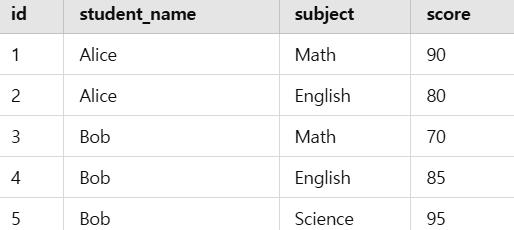

# Window 함수
## Window함수의 개념과 문법
    
### window함수의 개념
**행 집행**에 대해 집계와 유사한 연산을 수행함.

**❗집계연산과 윈도우 함수의 차이❗**
- 집계연산: 데이터를 요약해서 <U>단일 결과 행</U>으로 그룹화 `GROUP BY`
- 윈도우함수: 개별 행을 유지하면서 해당 행과 관련된 그룹 내에서 계산을 수행한다. `OVER(PARTITION BY)..`

    ➡️ 집계 결과를 개별 행과 함께 보고싶은 경우에 활용

## Over
> 윈도우 함수가 어떤 행을 기준으로 쿼리를 처리할지 정의하는 역할

**Over절의 2가지 형태**
```MYSQL
1. OVER(window spec)
2. OVER(미리 정의한 window_name)
```

- OVER(): 쿼리 내의 모든 행을 사용. 전체의 합 -> 각자 행의 합

- OVER(PARTITIONI BY 컬럼명): 개별행에 대해 컬럼명을 기준으로 SUM 집계 진행

- `SELECT`와 `ORDER BY`에서만 사용가능하다. 

- 아래 함수들에 대해서는 over절이 필수적이다.
    ```
    CUME_DIST()
    DENSE_RANK()
    FIRST_VALUE()
    LAG()
    LAST_VALUE()
    LEAD()
    NTH_VALUE()
    NTILE()
    PERCENT_RANK()
    RANK()
    ROW_NUMBER()
    ```


### **window_spec구성요소**
```MYSQL
[window_name] [PARTITION BY ...] [ORDER BY ...] [frame_clause]
```
`PARTITION BY... `
- 행들을 부분 그룹으로 나눔
- PARTITION이 생략\되면, 전체가 하나가 됨***

`FRAME_CLAUSE`      
- 현재 행을 기준으로 어느 범위까지 계산에 포함할지 정함
EX)  `UNBOUNDED PRECEDING AND CURRNET`   

---

# 14.20.1 윈도우 함수 설명(비집계)

## 💡예시 쿼리
```MYSQL
 SELECT
    val,
    ROW_NUMBER()   OVER w AS 'row_number',
    CUME_DIST()    OVER w AS 'cume_dist',
    PERCENT_RANK() OVER w AS 'percent_rank'
FROM numbers
WINDOW w AS (ORDER BY val);
+------+------------+--------------------+--------------+
| val  | row_number | cume_dist          | percent_rank |
+------+------------+--------------------+--------------+
|    1 |          1 | 0.2222222222222222 |            0 |
|    1 |          2 | 0.2222222222222222 |            0 |
|    2 |          3 | 0.3333333333333333 |         0.25 |
|    3 |          4 | 0.6666666666666666 |        0.375 |
|    3 |          5 | 0.6666666666666666 |        0.375 |
|    3 |          6 | 0.6666666666666666 |        0.375 |
|    4 |          7 | 0.8888888888888888 |         0.75 |
|    4 |          8 | 0.8888888888888888 |         0.75 |
|    5 |          9 |                  1 |            1 |
+------+------------+--------------------+--------------+
```

### CUME_DIST() OVER절: 누적분포값
> 각 그룹 내의 값의 누적 분포 반환 - 현재 행 값보다 작거나 같은 행의 비율


**🌱공식>**
```MYSQL
CUME_DIST = (현재 행보다 작거나 같은 행 수) / (전체 행 수)
```
- val = 1인 첫 번째와 두 번째 행은 2개가 작거나 같으므로 → 2 / 9 = 0.222...

- val = 3인 세 개의 행은 6개가 작거나 같으므로 → 6 / 9 = 0.666...

- val = 5인 행은 9개가 작거나 같으므로 → 9 / 9 = 1.0

### PERCENT_RANK() : 백분율 순위
> 현재 행의 상대적인 순위(최댓값 제외)

**🌱공식>**
```MYSQL
PERCENT_RANK = (순위-1) / (전체 행 수 - 1)
```
** Rank()순위 기준

>EX) 1,1,1,4,4,6,7,7,7,10

- val = 1, 두 개 다 순위 1위 → (1-1)/(9-1) = 0

- val=2, 3위 → (3-1)/(9-1) = 0.25


### DENSE_RANK() : 중복없이 순위 반환

예시> 1,1,1,2,2,3


## 💡예시 쿼리

```MYSQL
SELECT
  time, subject, val,
  FIRST_VALUE(val)  OVER w AS 'first',
  LAST_VALUE(val)   OVER w AS 'last',
  NTH_VALUE(val, 2) OVER w AS 'second',
  NTH_VALUE(val, 4) OVER w AS 'fourth'
FROM observations
WINDOW w AS (PARTITION BY subject ORDER BY time
 ROWS UNBOUNDED PRECEDING);
+----------+---------+------+-------+------+--------+--------+
| time     | subject | val  | first | last | second | fourth |
+----------+---------+------+-------+------+--------+--------+
| 07:00:00 | st113   |   10 |    10 |   10 |   NULL |   NULL |
| 07:15:00 | st113   |    9 |    10 |    9 |      9 |   NULL |
| 07:30:00 | st113   |   25 |    10 |   25 |      9 |   NULL |
| 07:45:00 | st113   |   20 |    10 |   20 |      9 |     20 |
| 07:00:00 | xh458   |    0 |     0 |    0 |   NULL |   NULL |
| 07:15:00 | xh458   |   10 |     0 |   10 |     10 |   NULL |
| 07:30:00 | xh458   |    5 |     0 |    5 |     10 |   NULL |
| 07:45:00 | xh458   |   30 |     0 |   30 |     10 |     30 |
| 08:00:00 | xh458   |   25 |     0 |   25 |     10 |     30 |
+----------+---------+------+-------+------+--------+--------+
```

### FIRST_VALUE
> 각 파티션에 첫번째로 입력된 값

### LAST_VALUE
> 각 파티션에 마지막으로 입력된 값

EX) 
- subject: st113, 10 입력 → 프레임에 10 ➡️ first_value : 10 & last_value : 10
- subject: st113, 9 입력 → 프레임에 10, 9 ➡️ fisrt_value : 10 & last_value : 9

💡 만약 파티션별로 마지막에 입력된 값을 보고 싶다면, 프레임설정을 바꿔주면 된다. 

`ROWS BETWEEN UNBOUNDED PRECEDING AND CURRNET NOW`

→ `ROWS BETWEEN UNBOUNDED PRECEDING AND UNBOUNDED FOLLOWIN`

### NTH_VALUE
> 윈도우 프레임 내에서 N번째 위치의 값을 반환하는 윈도우 함수

## 💡예시 쿼리
```MYSQL
SELECT
  t, val,
  LAG(val) OVER w AS 'lag',
  LEAD(val) OVER w AS 'lead',
  val - LAG(val)  OVER w AS 'lag diff',
  val - LEAD(val) OVER w AS 'lead diff'
FROM series
WINDOW w AS (ORDER BY t);
+----------+------+------+------+----------+-----------+
| t        | val  | lag  | lead | lag diff | lead diff |
+----------+------+------+------+----------+-----------+
| 12:00:00 |  100 | NULL |  125 |     NULL |       -25 |
| 13:00:00 |  125 |  100 |  132 |       25 |        -7 |
| 14:00:00 |  132 |  125 |  145 |        7 |       -13 |
| 15:00:00 |  145 |  132 |  140 |       13 |         5 |
| 16:00:00 |  140 |  145 |  150 |       -5 |       -10 |
| 17:00:00 |  150 |  140 |  200 |       10 |       -50 |
| 18:00:00 |  200 |  150 | NULL |       50 |      NULL |
+----------+------+------+------+----------+-----------+
```

### LAG()
>지연 - 위쪽 행의 값 가져옴
- `LAG(val)`: val기준으로 위쪽 행의 값 반환
- `LAG(val,2,0)`: 2행 위의 값을 가져오고, 없으면 0 반환

### LEAD()
> 선행 - 아래쪽 행의 값 가져옴
- `LEAD(val)`: val 기준으로 아래 행 값 반환
- `LEAD(val,2,0)`: 현재 행에서 2행 아래의 값을 가져오고 없으면 0 반환


## 💡예시 쿼리
```MYSQL
SELECT
  val,
  ROW_NUMBER() OVER w AS 'row_number',
  NTILE(2) OVER w AS 'ntile2',
  NTILE(4) OVER w AS 'ntile4'
FROM numbers
WINDOW w AS (ORDER BY val);
+------+------------+--------+--------+
| val  | row_number | ntile2 | ntile4 |
+------+------------+--------+--------+
|    1 |          1 |      1 |      1 |
|    1 |          2 |      1 |      1 |
|    2 |          3 |      1 |      1 |
|    3 |          4 |      1 |      2 |
|    3 |          5 |      1 |      2 |
|    3 |          6 |      2 |      3 |
|    4 |          7 |      2 |      3 |
|    4 |          8 |      2 |      4 |
|    5 |          9 |      2 |      4 |
+------+------------+--------+--------+
```

### NTILE()
> 전체 데이터를 N등분해서 각 행이 몇 번째 그룹에 속하는지 반환

```MYSQL
NTILE(N) OVER (ORDER BY 정렬기준)
```
EX)
- 8개 값을 NTILE(4) → 1,1,2,2,3,3,4,4
- 8개 값을 NTILE(3) → 1,1,1,2,2,2,3,3

# 14.19.1 윈도우 함수 설명(집계)
**GROUP BY없이 OVER()절을 사용해 집계함수처럼 사용 가능**

`예시: AVG(score) OVER (PARTITION BY class)`

DISTINCT옵션은 윈도우 함수와 함께 쓸 수 없음

##  데이터 타입 관련 주의사항
### SUM() & AVG()
- 정확한 숫자 타입(INT, DECIMAL): DECIMAL로 반환
- 근사 타입(FLOAT, DOUBLE) : DOUBLE로 반환
- **<u>시간/날짜 타입**</U>>에는 SUM()과 AVG()를 직접 사용할 수 없고 아래와 같이 변환 후에 사용해야함
  ```MYSQL
  SELECT SEC_TO_TIME(SUM(TIME_TO_SEC(time_col))) FROM tbl_name;
  SELECT FROM_DAYS(SUM(TO_DAYS(date_col))) FROM tbl_name;
  ```

---

## 집계함수
### COUNT()
> **NULL값 포함 X값의 개수를 반환**

EX)
- 일치하는 행이 없으면 → 0
- `COUNT(NULL)` → 0
- `COUNT(*)` → <U>NULL 상관없이</U> 전체 행 수 
- `COUNT(col)` → <U>NULL이 아닌 값만</U> 카운트

### GROUP_CONCAT()
> 그룹 내 NULL이 아닌 값들만 문자열로 이어 붙여 하나의 결과로 반환

```MYSQL
SELECT student_name,
  GROUP_CONCAT(test_score)
FROM student
GROUP BY student_name;
```       

   OR

```MYSQL
SELECT student_name,
  GROUP_CONCAT(DISTINCT test_score
  ORDER BY test_score DESC SEPARATOR ' ')
FROM student
GROUP BY student_name;
```            

- `SEPARATOR '문자열'`: 구분자지정
  - `SEPARATOR ''`로 공백 없이 이어붙일 수 있다.

---

**💡예시 테이블**
```MYSQL
SELECT
  student_name,
  subject,
  score,
  MAX(score) OVER (PARTITION BY student_name) AS max_score
FROM scores;
```


### MAX(), MIN() OVER

> 학생별 최대/최소 점수를 모든 행마다 표시


### SUM() OVER
> 학생별 모든 과목 점수 합계를 모든 행마다 표시

