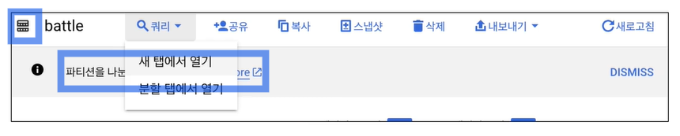
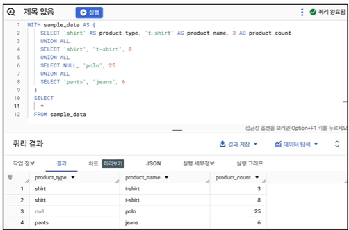
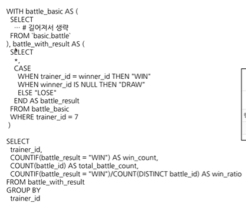
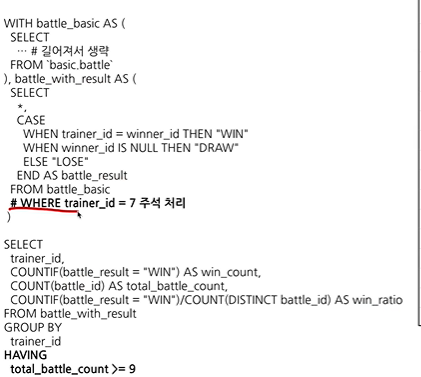

# 6-1. INTRO
# 6-2. 가독성을 챙기기 위하 SQL스타일 가이드

### 실수는 언제 발생하는가?
1. 문법을 잘못 알고 있는 경우
    - 문법을 공부하자

2. 데이터를 파악하지 않고 뭐리를 작성하는 경우
    - 데이터에 대한 메타정보, 컬럼의 정보(VALUE)를 잘 파악해야함.

3. 쿼리가 복잡한 경우
    - 나누기, 쪼개기 등을 통해 쿼리 단순화하기

---

👾 **쿼리를 변경해야 할 경우에 특정 부분만 바뀌었는지, 전체를 바꿨는지도 파악하는 것이 쉬우면 좋다.** 👾

: 기존의 것과 새로운 것을 비교하는 'DIFF를 뜬다'라는 것을 할 때 변경점 포인트를 알아채기 쉬우면 좋음. 

### SQL 스타일 가이드

SQL스타일 가이드에 대한 이야기를 미리 나누어볼 것. 

조직/사람마다의 작성하는 방식이 다름! 

**[권장사항]**
1. **예약어는 대문자로 작성**

    EX) SELECT, FROM, WHERE, 각종 함수

2. **컬럼이름은 snake_case로 작성**
    - python - snake_case
    - java   - CamelCase

3. **명시적인 이름**

    JOIN할 때 테이블의 이름을 명시적으로 설정할 수 있다면 명시적으로 진행

     Alias로 별칭지을때는 명시적인 이름을 적용

     ex) ~ AS a (x) // ~ AS pokemon_cnt(o)

4. **예약어나 컬럼은 한 줄에 하나씩 권장**

    컬럼은 바로 주석처리할 수 있는 장점이 있으므로, 한 줄에 하나씩 작성

```
SELECT
    col1,
    col2,
    col3,
FROM table
WHERE ~
```

5. **쉼표는 컬럼 바로 뒤에**


# 6-3. 가독성을 챙기기 위한 WITH문 & 파티션

## WITH문

- 쿼리의 결과를 다른 FROM절에서 재사용해야할 경우가 있음

- 반복을 최소화 하기 위해서 => WITH문 사용

### WTIH구문 사용 방법


```
추천하는 with문 사용방법

WITH base AS (   #처음에는 완전 베이스가 되는 테이블을 형성
SELECT
    col
FROM table
), 명시적 AS (    # 그 후에 계속 활용할 테이블 이름을 명시적으로 형성
SELECT
    col
FROM table
)

SELECT
FROM
WHERE~
```


## PARTITION



table엔 partition이란 것이 존재할 수 있음.

ex) 특정시기에 들어온 물건을 찾고 싶을 때, table의 partition이 존재하면 그 부분만 탐색하면 됨 (탐색하는 것도 비용이 많이 듦)

- 쿼리 성능 향상 + 비용 절감
    전체 데이터를 스캔하는 것보다 설정한 곳만 스캔하는 것이 더 빠름 & 비용 절감가능

- 데이터 관리 용이성
    특정 일자의 데이터를 모두 변경하거나 삭제해야하는 경우, 파티션이 있따면 쉽게 설정하거나 삭제할 수 있음. 


**새탭에서 열기를 눌렀을 때**


- 데이터의 범위를 조정하고 싶다면, 초록색의 날짜 데이터를 조정하면 됨

- 조정하면 오른쪽 상단 부분에 데이터의 크기가 표시됨 -> 얼만큼 데이터가 줄어드는지 늘어나는지를 확인할 수 있음.

- DATETIME_ADD : `날짜, INTERVAL n day` : 날짜 + n일

```
SELECT  
  id,
  player1_id,
  player2_id  --- 가져올 컬럼을 설정할 때마다 처리하는 데이터 크기가 달라지는 것을 볼 수 있음
FROM `dart-b-study-bigquery.basic.battle` 
WHERE battle_datetime BETWEEN DATETIME("2022-11-16") AND DATETIME_ADD("2024-11-16", INTERVAL 1 DAY) LIMIT 1000
--- 파티션이 필수인 곳은 where조건문에서 파티션 필터를 걸지 않으면 오류가 발생함.
```

# 6-4. 데이터 결과 검증
## 데이터 결과 검증(data result validation)

**: SQL쿼리 후 얻은 결과가 예상과 일치하는지 확인하는 과정**

방법>

1. 내가 기대하는 예상 결과를 정의
2. 쿼리 작성
3. 두개가 일치하는가를 비교

❗❗>
- 문제를 잘 정의하고 미리 작성해볼 것.
- 도메인 특수성, 규칙 등 잘 파악하기


## 데이터 결과 검증할 때 자주 활용하는 SQL 쿼리
### 대표적으로 활용하는 SQL문법

1. COUNT(*) : 의도한 데이터의 행 개수가 맞는가? 
2. NOT NULL : 필수 필드가 비어있지 않는가? 
3. DISTINCT : 데이터의 고유값 확인 => 중복이 있진 않는지?
    - COUNT(DISTINCT컬럼) = COUNT(컬럼) 인지 확인
4. IF문, CASE WHEN : 의도와 같다면 TRUE, 아니면 FALSE가 출력되도록 설정

### 데이터 결과 검증 활용 방식

1) 특정 user_id로 필터링을 걸어서 확인
    - 1명의 데이터를 필터링해, 1명의 데이터 예상결과가 쿼리 결과와 동일한지 확인
    - 다른 user_id를 3-4건 더 추가해서 확인
    - 추가 후에도 동일한 결과가 나오면 user_id조건을 삭제하고 전체 데이터를 조회

2) WITH문을 사용해 샘플 데이터 생성하기
    - WITH문을 사용해 샘플 데이터 생성.
    - 결과를 예상해서 쿼리를 작성
    - 복잡한 데이터에서 실행하기 전에, 쿼리 자체가 올바른지 확인할 때 주로 사용



- UNION ALL : ROW단위로 합친다 (아래로 붙인다)

- JOIN : 우측에 붙인다

# 6-5. 데이터 결과 검증 예시

1) 전체 테이블 파악
2) 한 명의 특정 트레이너가 승리한 비율 구하기
    - 참여한 배틀의 수 / 승리한 배틀의 수
    - 예상 정답세우기 ex) player_id가 7이 승리한 비율은 0.55556이다

3) 쿼리 작성

- 통합 데이터 만들기 (UNION 활용)


5) 실제와 비교




6) 맞다면 특정 유저 조건 제외



